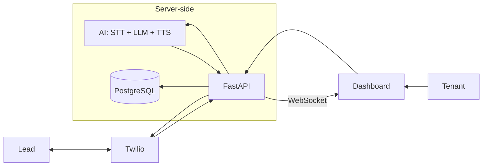
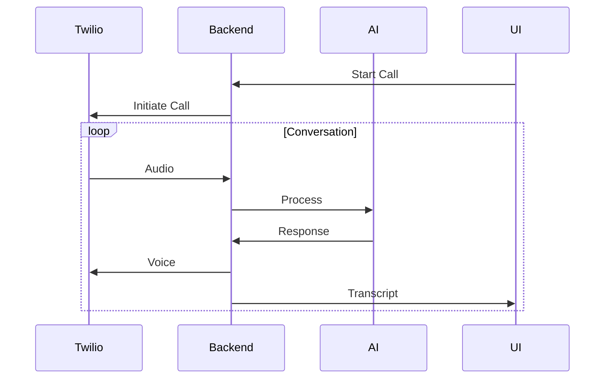

# 🚀 Sagent

### Real-Time AI Voice Call Agent Platform

<p align="center">
  
</p>
 
<p align="center">
  <b>Talk. Listen. Think. Respond — in real time.</b>
</p>


<p align="center">
  
  
  
  
  
  
  
  
</p>


## 🧠 What is Sagent?

**Sagent** is a real-time AI voice call agent that can:

* 📞 Make outbound calls
* 📲 Handle inbound calls
* 🧠 Understand speech using LLMs
* 🗣️ Respond with natural voice
* 📡 Stream live transcripts to a dashboard


## ⚡ Core Capabilities

* 🔁 **Streaming pipeline**: STT → LLM → TTS
* 📡 **Live transcript via WebSocket**
* 🧑‍💼 **Multi-tenant architecture**
* ⚙️ **Configurable AI agent (prompt-driven)**
* 📞 **Twilio call integration (inbound + outbound)**


## 🏗️ Architecture Overview



## ✨ Key Features

* 🔁 Real-time voice interaction (STT → LLM → TTS)
* 📡 Live transcript streaming (WebSocket)
* 🧑‍💼 Multi-tenant architecture
* ⚙️ Configurable AI agent (prompt-based behavior)
* 📞 Outbound & inbound call support
* 🗂️ Call history with transcripts & recordings
* 📱 Phone-like UI dashboard


## 🎯 Why This Project Stands Out

* Real-time AI system (not batch or async)
* Full-stack architecture (FastAPI + React)
* Voice + LLM + Telephony integration
* Production-ready design (multi-tenant, scalable)


## 🎥 Demo Preview (Coming Soon)

> Live call + real-time transcript streaming UI


## 🧩 Tech Stack

### Backend

* FastAPI (Python)
* PostgreSQL (Render)
* WebSocket (real-time streaming)

### Frontend

* React (TypeScript)
* Tailwind CSS

### AI & Voice

* STT: ElevenLabs Scribe (Realtime)
* LLM: OpenAI API
* TTS: ElevenLabs Flash

### Telephony

* Twilio (calls + recordings)

### Hosting

* Render


## 📁 Project Structure

```bash
Sagent/
├── backend/      # FastAPI backend
├── frontend/     # React dashboard
├── docs/         # system design documents
├── infra/        # deployment configs
└── README.md
```


## 🔄 Core Flow

### Outbound Call




## 📞 Use Cases

* AI sales agent (cold calls)
* customer support automation
* appointment booking
* AI receptionist
* voice-based SaaS demos


## 🎯 Design Principles

* **Real-time first** (low-latency streaming)
* **Modular architecture** (clean separation)
* **Scalable by design** (multi-tenant ready)
* **AI-centric** (prompt-driven behavior)


## 🚀 Getting Started

### 1. Clone the repo

```bash
git clone https://github.com/oceanstar88/sagent.git
cd sagent
```


### 2. Setup backend

```bash
cd backend
pip install -r requirements.txt
uvicorn app.main:app --reload
```


### 3. Setup frontend

```bash
cd frontend
npm install
npm run dev
```


### 4. Configure environment

Create [`.env`](.env) file:

```env
DATABASE_URL=
JWT_SECRET=

TWILIO_ACCOUNT_SID=
TWILIO_AUTH_TOKEN=
TWILIO_PHONE_NUMBER=

ELEVENLABS_API_KEY=
OPENAI_API_KEY=
```


## 📡 Demo Capabilities

* Start a call from dashboard
* Receive inbound call
* Watch live transcript
* Review call history


## 📚 Documentation

Detailed system design available in [docs](./docs/1__System-Architecture-Design.md)

Includes:

* system architecture
* AI engine design
* backend & frontend design
* API spec
* sequence diagrams


## 🔮 Future Improvements

* call analytics dashboard
* CRM integration
* multi-agent orchestration
* voice cloning
* multilingual support


## 👨‍💻 Author

Built as a **high-performance AI voice agent system demo**
for showcasing real-time AI + telephony integration.


## ⭐️ Summary

**Sagent** demonstrates:

* real-time AI systems
* voice + LLM integration
* full-stack engineering capability
* production-level architecture


> This is not just a demo — it's a foundation for real AI voice products.

<p align="center">
  ⭐ If you find this interesting, consider starring the repo!
</p>

