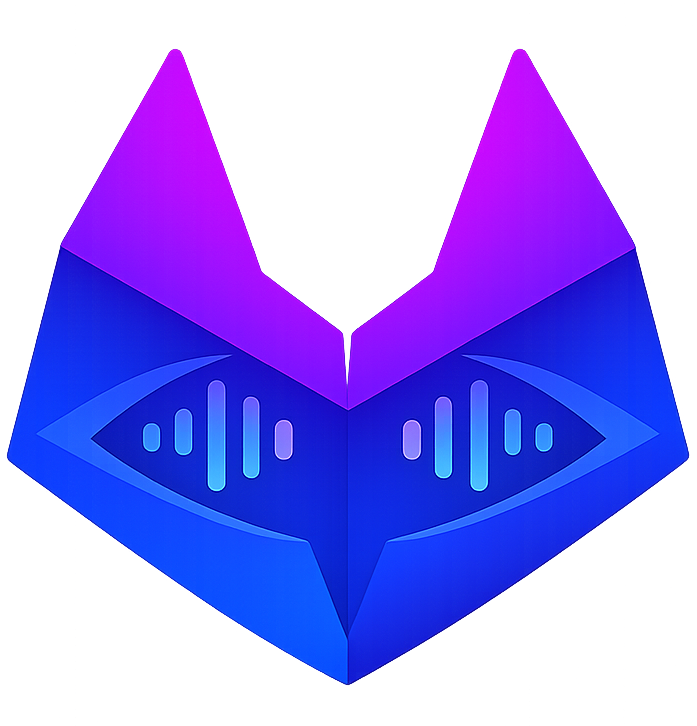
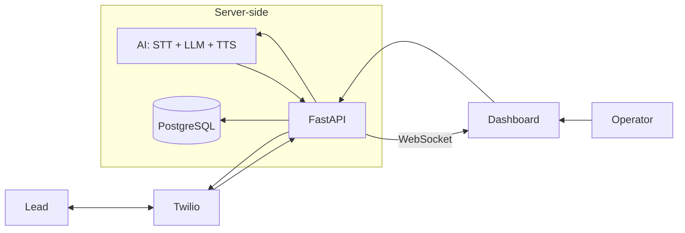
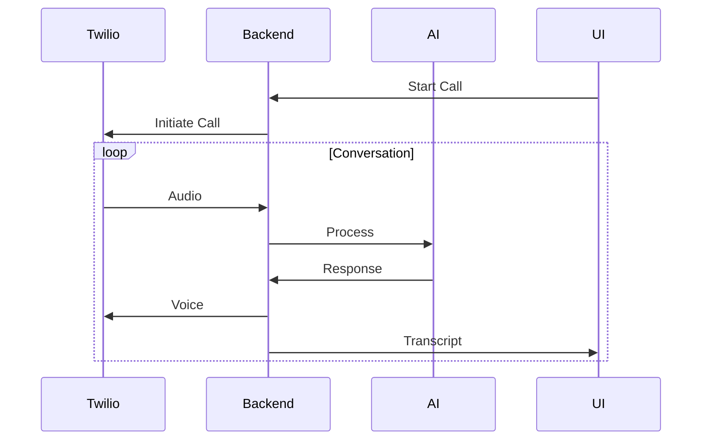

<p align="center">
  
</p>

<h1 align="center">Sagent</h1>

<p align="center">
  <b>Real-Time AI Voice Call Agent Platform</b>
</p>

<p align="center">
  Talk. Listen. Think. Respond — in real time.
</p>

<p align="center">
  
  
  
  
  
  
  
  
</p>


## 🧠 What is Sagent?

**Sagent** is a real-time AI voice call agent that can:

* 📞 Make outbound calls
* 📲 Handle inbound calls
* 🧠 Understand speech using LLMs
* 🗣️ Respond with natural voice
* 📡 Stream live transcripts to a dashboard
* 🎛️ Manage agent settings, account pages, and theme preferences in the browser
* 🔐 Support email verification, Google sign-in, avatars, and password recovery


## ⚡ Core Capabilities

* 🔁 **Streaming pipeline**: STT → LLM → TTS
* 📡 **Live transcript via WebSocket**
* 🧑‍💼 **User-scoped account architecture**
* ⚙️ **Configurable AI agent (prompt-driven)**
* 📞 **Twilio call integration (inbound + outbound)**


## 🏗️ Architecture Overview



## ✨ Key Features

* 🔁 Real-time voice interaction (STT → LLM → TTS)
* 📡 Live transcript streaming (WebSocket)
* 🧑‍💼 User-scoped account architecture
* ⚙️ Configurable AI agent (prompt-based behavior)
* 📞 Outbound & inbound call support
* 🗂️ Call history with transcripts & recordings
* 📱 Phone-like UI dashboard


## 🎯 Why This Project Stands Out

* Real-time AI system (not batch or async)
* Full-stack architecture (FastAPI + Next.js)
* Voice + LLM + Telephony integration
* Production-ready design (secure, scalable)


## 🎥 Demo Preview (Coming Soon)

> Live call + real-time transcript streaming UI


## 🧩 Tech Stack

### Backend

* FastAPI (Python, managed with uv)
* PostgreSQL (Render)
* WebSocket (real-time streaming)

### Frontend

* Next.js App Router + React 19 (TypeScript, managed with Bun)
* Tailwind CSS v4 + next/font

### AI & Voice

* STT: ElevenLabs Scribe (Realtime)
* LLM: OpenAI API
* TTS: ElevenLabs Flash

### Telephony

* Twilio (calls + recordings)

### Hosting

* Render


## 📁 Project Structure

```bash
Sagent/
├── backend/      # FastAPI backend
├── frontend/     # Next.js operator dashboard
├── docs/         # system design documents
└── README.md
```


## 🔄 Core Flow

### Outbound Call




## 📞 Use Cases

* AI sales agent (cold calls)
* customer support automation
* appointment booking
* AI receptionist
* voice-based SaaS demos


## 🎯 Design Principles

* **Real-time first** (low-latency streaming)
* **Modular architecture** (clean separation)
* **Scalable by design** (user-scoped and extensible)
* **AI-centric** (prompt-driven behavior)


## 🚀 Getting Started

### 1. Clone the repo

```bash
git clone https://github.com/oceanstar88/sagent.git
cd sagent
```


### 2. Setup backend

```bash
cd backend
uv sync
uv run uvicorn app.main:app --reload
```


### 3. Setup frontend

```bash
cd frontend
bun install
bun run dev
```


### 4. Configure environment

Create [`.env`](.env) file:

```env
DATABASE_URL=
JWT_SECRET=
FRONTEND_APP_URL=http://localhost:3000

AUTH_ALLOW_TEST_EMAIL_DOMAINS=true
EMAIL_VERIFICATION_EXPIRE_HOURS=24
GOOGLE_OAUTH_CLIENT_ID=

AVATAR_MAX_BYTES=5242880
AVATAR_IMAGE_SIZE=512
CLOUDINARY_CLOUD_NAME=
CLOUDINARY_API_KEY=
CLOUDINARY_API_SECRET=
CLOUDINARY_AVATAR_FOLDER=sagent/avatars

SMTP_HOST=
SMTP_PORT=587
SMTP_USERNAME=
SMTP_PASSWORD=
SMTP_USE_TLS=true
SMTP_USE_SSL=false
SMTP_FROM_EMAIL=no-reply@sagent.local

TWILIO_ACCOUNT_SID=
TWILIO_AUTH_TOKEN=
TWILIO_PHONE_NUMBER=

ELEVENLABS_API_KEY=
OPENAI_API_KEY=
```

For the frontend, create `frontend/.env.local` with:

```env
NEXT_PUBLIC_API_BASE_URL=http://localhost:8000/v1
NEXT_PUBLIC_GOOGLE_CLIENT_ID=
```

## Account Flows

Sagent now includes the following account capabilities in addition to the core call dashboard:

* Email/password signup with required email verification
* Verification resend and blocked sign-in for unverified password accounts
* Google signup and sign-in through Google Identity Services
* Password recovery with forgot-password and reset-password routes
* Cloudinary-backed profile avatars normalized with Pillow
* Persisted account theme preference across signed-in sessions


## 📡 Demo Capabilities

* Create an operator account with email signup
* Sign in with email and password
* Start a call from dashboard
* Receive inbound call
* Watch live transcript
* Review call history


## 📚 Documentation

Detailed system design available in [docs](./docs/1__System-Architecture-Design.md)

Includes:

* system architecture
* AI engine design
* backend & frontend design
* API spec
* sequence diagrams


## 🔮 Future Improvements

* call analytics dashboard
* CRM integration
* multi-agent orchestration
* voice cloning
* multilingual support


## 👨‍💻 Author

Built as a **high-performance AI voice agent system demo**
for showcasing real-time AI + telephony integration.


## ⭐️ Summary

**Sagent** demonstrates:

* real-time AI systems
* voice + LLM integration
* full-stack engineering capability
* production-level architecture


> This is not just a demo — it's a foundation for real AI voice products.

<p align="center">
  ⭐ If you find this interesting, consider starring the repo!
</p>

