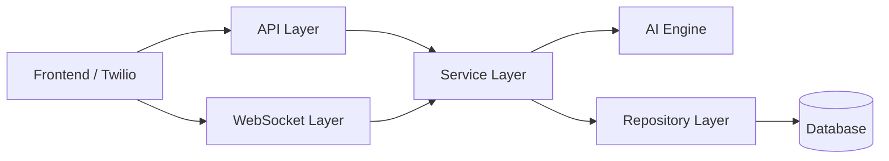
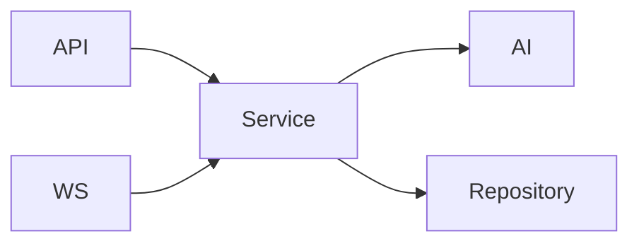
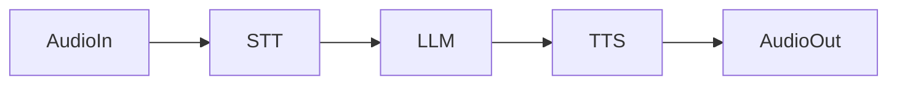
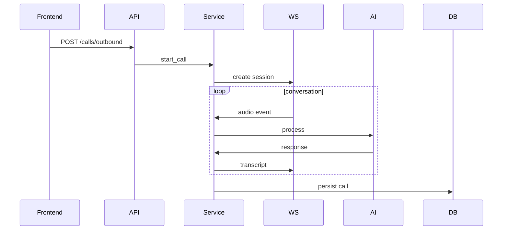

# 🧠 Backend Architecture Overview

This backend is built with **FastAPI** and follows a **layered, modular architecture** designed for:

* real-time voice processing
* multi-tenant scalability
* clean separation of concerns
* production-readiness


## 🏗️ High-Level Architecture




## 📁 Project Structure

```text
app/
├── main.py
├── core/
├── api/
├── ws/
├── services/
├── ai/
├── models/
├── schemas/
├── repositories/
├── integrations/
└── utils/
```


# 📦 Folder Responsibilities


## 🚀 `main.py` — Application Entry Point

**Role:**

* Initializes FastAPI app
* Registers routes and middleware
* Mounts WebSocket handlers

**Why it exists:**

* Acts as the **composition root** where all modules are wired together


## ⚙️ `core/` — Core Infrastructure

```text
core/
├── config.py
├── security.py
├── database.py
└── logging.py
```

**Responsibilities:**

* App configuration (env variables)
* JWT authentication & password hashing
* Database connection management
* Logging setup

**Key Principle:**

> Centralize cross-cutting concerns (config, security, DB)


## 🌐 `api/` — REST API Layer

```text
api/
├── deps.py
└── routes/
```

**Responsibilities:**

* Define HTTP endpoints
* Validate requests (via schemas)
* Enforce authentication

**Important Rule:**

> ❌ No business logic here
> ✅ Only request/response handling


## 🔌 `ws/` — WebSocket Layer (Real-Time Core)

```text
ws/
├── manager.py
├── observer.py
└── twilio_stream.py
```

**Responsibilities:**

* Handle real-time communication
* Maintain active call sessions
* Stream transcripts to frontend
* Process telephony audio streams


### WebSocket Architecture


### Components

* **manager.py** → session registry (active calls)
* **observer.py** → frontend live updates
* **twilio_stream.py** → telephony audio handling


## 🧩 `services/` — Business Logic Layer

```text
services/
├── call_service.py
├── session_service.py
├── transcript_service.py
└── agent_service.py
```

**Responsibilities:**

* Core application logic
* Call lifecycle management
* Session orchestration
* AI coordination


### Service Flow




## 🤖 `ai/` — Voice AI Engine

```text
ai/
├── pipeline.py
├── stt.py
├── llm.py
├── tts.py
└── turn_taking.py
```

**Responsibilities:**

* Speech-to-text processing
* LLM reasoning
* Text-to-speech generation
* Turn-taking & interruption handling


### AI Pipeline




## 🧱 `models/` — Database Models (ORM)

**Responsibilities:**

* Define database tables using ORM (e.g., SQLAlchemy)
* Represent core entities (User, Call, Transcript)


## 📨 `schemas/` — API Data Contracts

**Responsibilities:**

* Request validation
* Response formatting
* Type safety between frontend and backend


### Key Distinction

| Layer   | Purpose            |
| ------- | ------------------ |
| models  | database structure |
| schemas | API contract       |


## 🗃️ `repositories/` — Data Access Layer

**Responsibilities:**

* Encapsulate database queries
* Provide clean interface for data operations


### Why this exists

> Prevents business logic from directly depending on SQL


## 🔗 `integrations/` — External Services

```text
integrations/
├── twilio_client.py
├── elevenlabs_client.py
└── openai_client.py
```

**Responsibilities:**

* Wrap third-party APIs
* Handle retries, errors, and formatting


### Key Benefit

> Easy to swap providers without breaking core logic


## 🧰 `utils/` — Shared Utilities

**Responsibilities:**

* Helper functions
* Audio processing utilities
* Validators and formatters


# 🔄 End-to-End Flow Example


## 📞 Outbound Call




# 🎯 Design Principles


## 1. Separation of Concerns

Each layer has a **single responsibility**:

* API → transport
* Service → logic
* AI → intelligence
* Repo → data


## 2. Real-Time First

* WebSocket layer is isolated and optimized
* session-based architecture


## 3. Scalability

* easy to introduce Redis / queues
* modular AI components


## 4. Maintainability

* testable services
* replaceable integrations
* clear boundaries


# ✅ Summary

This backend architecture:

* supports **real-time AI voice interactions**
* enforces **clean modular design**
* is **production-ready and scalable**

