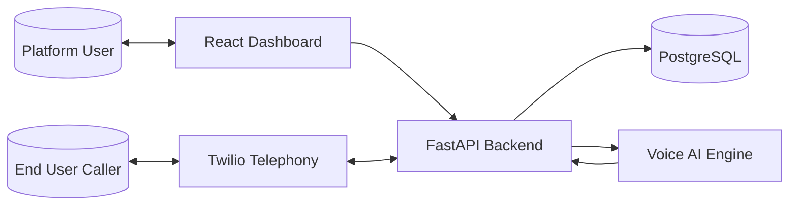
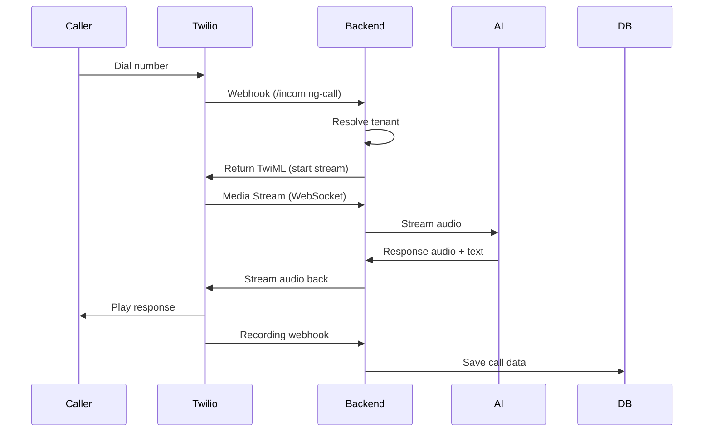
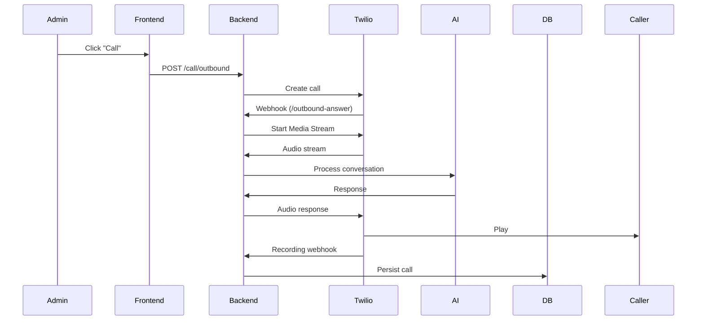
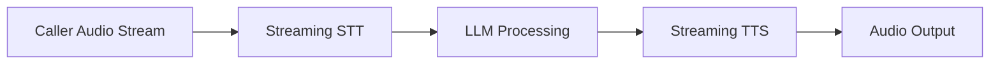
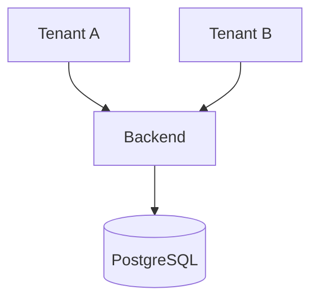
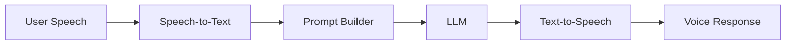
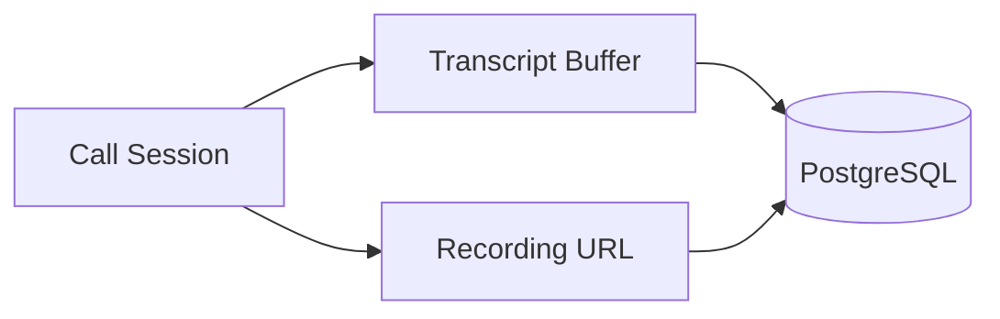
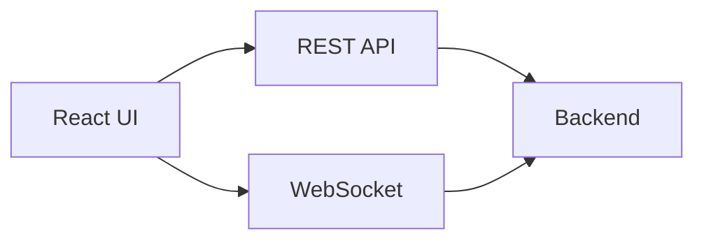
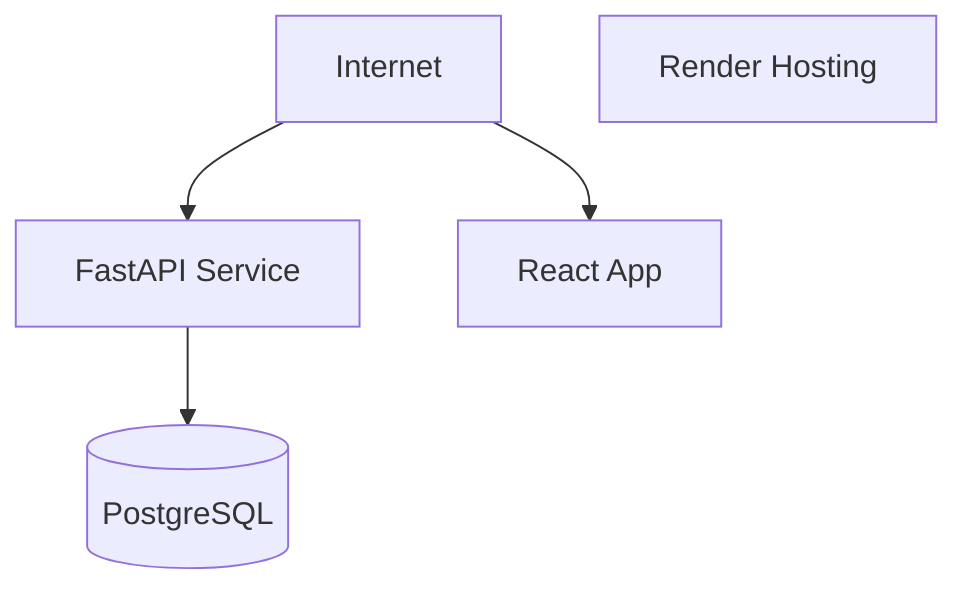

# 📄 System Architecture Design

**AI Voice Call Agent Platform (Multi-Tenant, Real-Time)**

## 1. 🧠 Overview

### 1.1 Purpose

This document defines the **high-level architecture** of a multi-tenant AI voice call platform that supports:

* Outbound AI-driven calls (cold calling)
* Inbound AI-powered reception
* Real-time voice interaction (streaming)
* Configurable AI agents per tenant

### 1.2 Design Goals

* **Low latency** (<1–1.5s perceived response)
* **Real-time streaming pipeline**
* **Multi-tenant isolation**
* **Modular architecture**
* **Production-aligned design (but demo-friendly)**

### 1.3 Technology Stack

* Telephony: Twilio
* AI:  
  * LLM → OpenAI
  * STT/TTS → ElevenLabs
* Backend: FastAPI
* Frontend: React (TypeScript)
* Database: PostgreSQL
* Hosting: Render

# 2. 🏗️ High-Level Architecture

## 2.1 Component Responsibilities

| Component         | Responsibility                             |
| ----------------- | ------------------------------------------ |
| Twilio            | Call handling, media streaming, recordings |
| Backend (FastAPI) | Orchestration, session management, APIs    |
| Voice AI Engine   | STT → LLM → TTS processing                 |
| PostgreSQL        | Persistent storage                         |
| Frontend          | Admin UI, real-time visualization          |
|||

# 3. 🔁 Call Flow Architecture

## 3.1 Inbound Call Flow

## 3.2 Outbound Call Flow

# 4. ⚡ Real-Time Voice Pipeline Architecture

## 4.1 Pipeline Characteristics

* Streaming-based (chunk processing)
* Partial transcript handling
* Incremental response generation
* Low-latency audio feedback loop

# 5. 🏢 Multi-Tenant Architecture

## 5.1 Tenant Isolation Model

## 5.2 Key Principles

* Single database, shared schema
* Isolation via `tenant_id`
* Per-tenant configuration:

  * API keys
  * agent profiles
  * phone numbers

## 5.3 Request Flow with Tenant Context

# 6. 🧠 AI Agent Integration Architecture

## 6.1 Prompt Composition Layer

* Combines:

  * agent role
  * goal
  * system instructions
  * conversation context

# 7. 🔌 External Integrations

## 7.1 Telephony Integration

* Twilio Media Streams (WebSocket)
* Twilio Webhooks:

  * inbound call
  * outbound answer
  * recording completion

## 7.2 AI Services Integration

* STT/TTS via ElevenLabs
* LLM via OpenAI

# 8. 🗄️ Data Flow Architecture

## 8.1 Data Types

* Real-time (in-memory):

  * transcripts
  * audio chunks

* Persistent:

  * call metadata
  * transcript
  * recording URL

# 9. 🖥️ Frontend Interaction Architecture

## 9.1 Communication Types

| Type      | Usage             |
| --------- | ----------------- |
| REST API  | CRUD operations   |
| WebSocket | real-time updates |
|||

# 10. 🚀 Deployment Architecture

## 10.1 Deployment Characteristics

* Single-region deployment (demo scope)
* Backend + frontend hosted on Render
* Managed PostgreSQL instance on Render

# 11. ⚠️ Constraints & Tradeoffs

## 11.1 Constraints

* Third-party dependency (Twilio, ElevenLabs, OpenAI)
* Network latency (region-dependent)
* Real-time streaming complexity

## 11.2 Tradeoffs

| Decision               | Tradeoff                |
| ---------------------- | ----------------------- |
| Single DB multi-tenant | simpler, less isolation |
| External audio storage | added dependency        |
| Streaming pipeline     | higher complexity       |

# 12. 🔮 Future Architecture Extensions

* Multi-region deployment (latency optimization)
* Dedicated AI worker services
* Queue system (Redis/Kafka)
* Advanced analytics pipeline
* Multi-agent orchestration

# 13. ✅ Summary

This architecture provides:

* Real-time AI voice interaction
* Multi-tenant SaaS structure
* Clean separation of concerns
* Production-aligned design

It balances:

* **engineering rigor**
* **demo simplicity**
* **scalability readiness**

## ✔️ Next Recommended Document

Proceed with:

👉 [**Voice AI Engine Design**](./2__Voice-AI-Engine-Design.md)

This is where the system becomes truly differentiated.