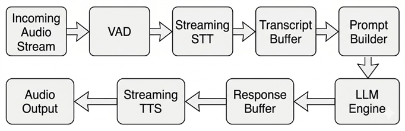
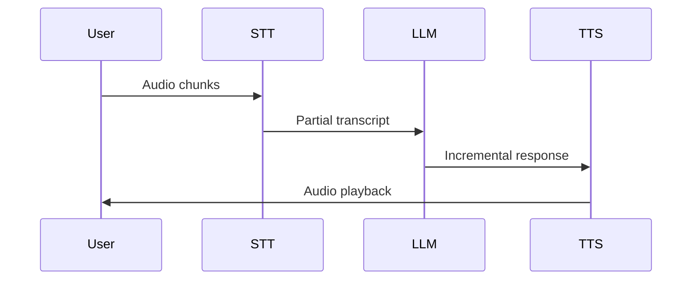
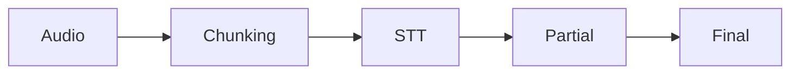
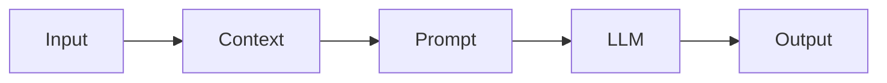
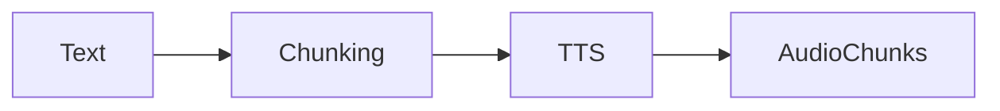
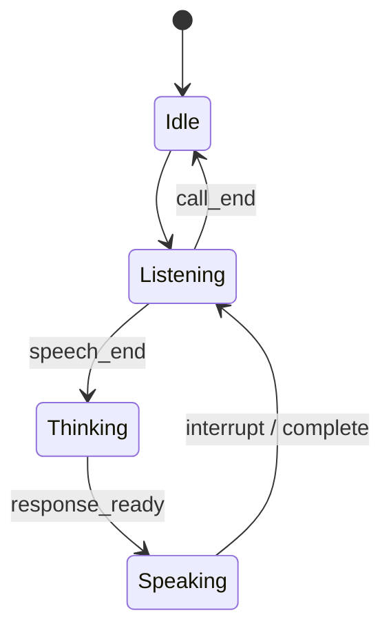
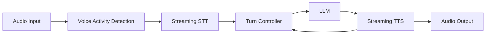

# 📄 Voice AI Engine Design

**AI Voice Call Agent Platform (Real-Time, Multi-Tenant)**


## 1. 🧠 Overview

### 1.1 Purpose

This document defines the architecture and internal design of the **Voice AI Engine**, responsible for enabling:

* Real-time bidirectional voice interaction
* Speech understanding and generation
* Context-aware dialogue
* Natural conversational turn-taking


### 1.2 Responsibilities

The Voice AI Engine handles:

* Streaming Speech-to-Text (STT)
* LLM-based reasoning
* Streaming Text-to-Speech (TTS)
* Conversation state management
* Turn-taking & interruption control


## 2. 🏗️ High-Level Architecture



## 3. ⚡ Real-Time Streaming Pipeline


### 3.1 Processing Flow




### 3.2 Design Principle

✅ Streaming-first architecture:

```
Audio → Partial STT → Incremental LLM → Streaming TTS
```


### 3.3 Benefits

* Sub-second responsiveness
* Natural dialogue flow
* Supports interruption
* Reduced perceived latency


## 4. 🎙️ Speech-to-Text (STT) Design


### 4.1 Integration

* Provider: ElevenLabs (Scribe v2 Realtime)


### 4.2 Pipeline




### 4.3 Output Types

| Type               | Purpose              |
| ------------------ | -------------------- |
| Partial transcript | real-time processing |
| Final transcript   | persistence          |


### 4.4 Optimization

* chunk size: 100–300ms
* silence detection
* confidence filtering


## 5. 🤖 LLM Processing Design


### 5.1 Integration

* Provider: OpenAI


### 5.2 Pipeline




### 5.3 Prompt Composition

```
System Prompt =
  Agent Role
  + Goal
  + Behavioral Rules
  + Conversation Context
  + Current Input
```


### 5.4 Context Strategy

* sliding window
* token limit control
* optional summarization


### 5.5 Response Strategy

* short, voice-friendly sentences
* low verbosity
* structured phrasing


## 6. 🔊 Text-to-Speech (TTS) Design


### 6.1 Integration

* Provider: ElevenLabs (Flash v2.5)


### 6.2 Pipeline




### 6.3 Configuration

* voice_id (per tenant)
* speaking rate
* tone control
* Singapore-optimized delivery


## 7. 🧠 Conversation State Management


### 7.1 Session Model

```python
session = {
  "tenant_id": str,
  "call_id": str,
  "history": [],
  "state": "Idle | Listening | Thinking | Speaking",
  "agent_config": {},
}
```


### 7.2 State Machine




## 8. 🔄 Turn-Taking & Interruption Handling (Critical)


### 8.1 Design Objective

Enable **natural, human-like conversation** with:

* instant interruption (barge-in)
* no overlapping speech
* user-priority control


### 8.2 Turn Controller Architecture




### 8.3 Key Signals

| Signal                | Source |
| --------------------- | ------ |
| speech_start / end    | VAD    |
| partial transcript    | STT    |
| speaking state        | TTS    |
| audio playback status | Player |


### 8.4 Interruption Detection

```python
is_interrupt = (
    state == "Speaking"
    and vad.speech_detected
    and vad.duration > 150ms
    and stt.confidence > threshold
)
```


### 8.5 TTS Cancellation

```python
tts_stream.cancel()
audio_output.clear()
state = "Listening"
```

Requirements:

* stop within <100ms
* flush buffer immediately


### 8.6 Execution Loop

```python
while call_active:

    audio = receive_audio()
    vad.update(audio)

    if vad.speech_detected:
        stt.feed(audio)

        if state == "Speaking":
            cancel_tts()
            state = "Listening"

    if vad.speech_end:
        text = stt.finalize()

        state = "Thinking"

        response = llm.generate(text, context)

        state = "Speaking"

        for chunk in tts.stream(response):

            if vad.speech_detected:
                cancel_tts()
                state = "Listening"
                break

            play(chunk)
```


### 8.7 Advanced Behavior

* adaptive silence threshold (300–700ms)
* early LLM triggering (optional)
* user always has priority


### 8.8 Edge Case Handling

| Case               | Solution                     |
| ------------------ | ---------------------------- |
| noise interruption | duration + confidence filter |
| double speaking    | force AI stop                |
| silence            | fallback prompt              |


## 9. ⚡ Latency Optimization


### 9.1 Targets

| Stage | Target |
| ----- | ------ |
| STT   | <300ms |
| LLM   | <500ms |
| TTS   | <300ms |


### 9.2 Techniques

* streaming everywhere
* parallel execution
* prompt minimization
* caching system prompt


## 10. 🌏 Localization (Singapore)


### 10.1 Strategy

* understand Singlish
* respond in professional English


### 10.2 Behavior

* polite phrasing
* concise replies
* avoid excessive slang


## 11. 🔄 Error Handling


### 11.1 Failures

* STT errors
* LLM timeout
* TTS failure


### 11.2 Fallback

```
"Sorry, could you repeat that?"
```


## 12. 🔌 Interfaces


### Input

* audio stream (WebSocket)
* session metadata


### Output

* audio stream
* transcripts
* events


## 13. 🚀 Scalability


### Current

* single-instance
* in-memory sessions


### Future

* distributed workers
* queue-based pipeline
* GPU inference


## 14. 🔮 Future Enhancements


* emotion-aware responses
* adaptive speech rate
* multilingual support
* long-term memory


## 15. ✅ Summary

The Voice AI Engine delivers:

* real-time conversational AI
* streaming-based processing
* robust turn-taking system
* configurable agent behavior

It is designed for:

* low latency
* natural interaction
* production scalability


# ✔️ Next Step

Proceed with:

👉 [**Backend System Design**](./3__Backend-System-Design.md)

This will connect:

* WebSockets
* Twilio
* multi-tenant logic
* AI engine orchestration
