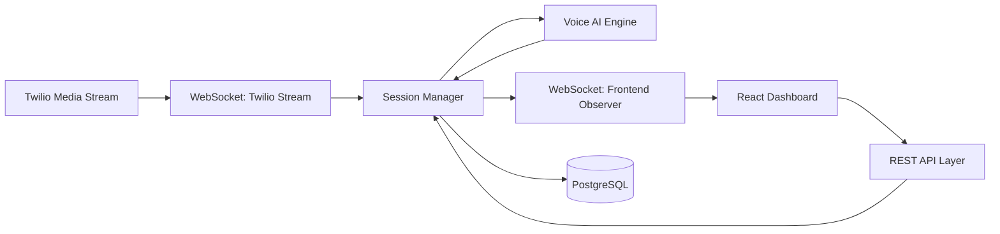
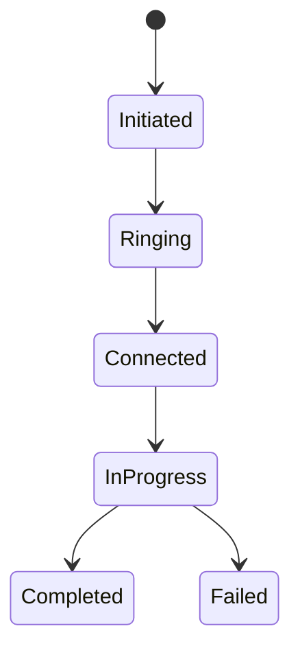
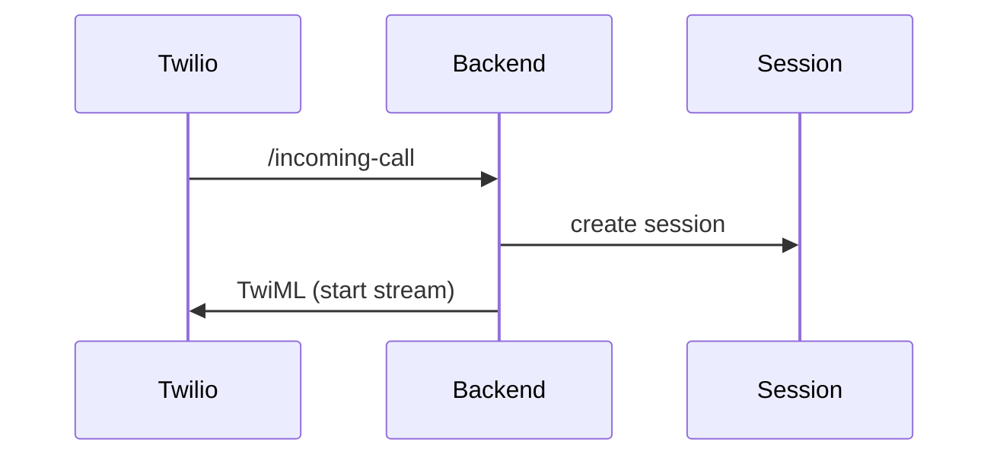
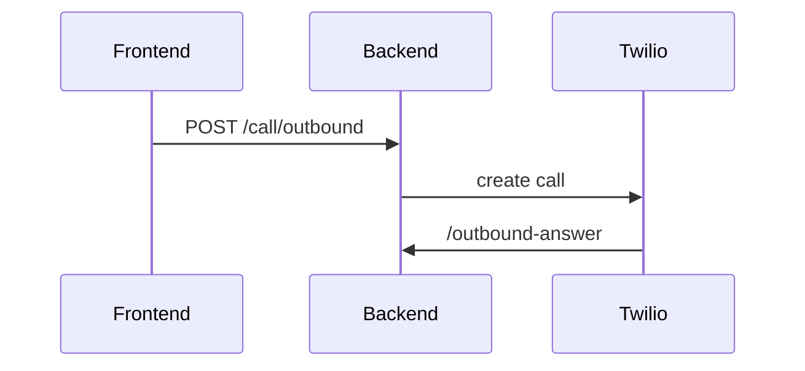
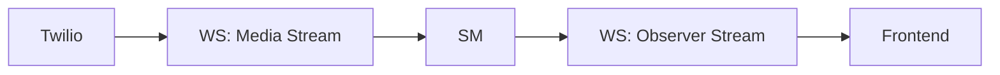
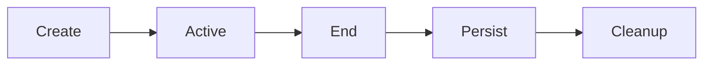
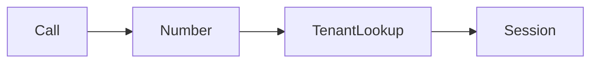
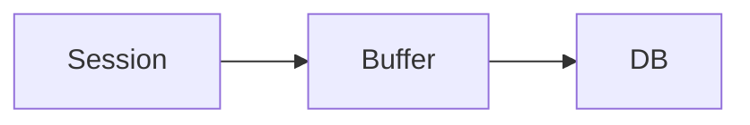

# 📄 Backend System Design

**AI Voice Call Agent Platform (Real-Time, Multi-Tenant, Transcript-Streaming)**

## 1. 🧠 Overview

### 1.1 Purpose

This document defines the backend system responsible for:

* Real-time AI voice call orchestration
* Telephony integration via Twilio
* AI pipeline coordination (STT → LLM → TTS)
* **Live transcript streaming to frontend dashboard**
* Multi-tenant data isolation
* Persistent storage in PostgreSQL


### 1.2 Key Capabilities

* Inbound & outbound call handling
* Streaming audio processing (WebSocket)
* Real-time transcript broadcasting
* Call state synchronization with frontend
* Session-based orchestration


## 2. 🏗️ Backend Architecture Overview




## 3. 🧩 Core Components


### 3.1 REST API Layer

Handles:

* authentication (JWT)
* tenant settings (API keys, agent config)
* contact management
* outbound call initiation
* call history retrieval


### 3.2 WebSocket Layer

Two channels:


#### A. Twilio Media Stream

```text
Twilio ↔ Backend
```

* inbound caller audio
* outbound AI audio


#### B. Frontend Observer Stream

```text
Backend → Frontend
```

Streams:

* live transcripts (user + agent)
* call state updates
* AI thinking status


### 3.3 Session Manager (Core)

Central orchestrator:

* maintains call state
* manages conversation history
* coordinates AI engine
* broadcasts transcripts
* enforces tenant isolation


### 3.4 Voice AI Engine Integration

* streaming STT/LLM/TTS
* interruption-aware dialogue
* returns transcripts + audio (audio only to Twilio)


### 3.5 Database Layer

* persists calls, transcripts, settings
* all data scoped by `tenant_id`


## 4. 🔁 Call Lifecycle Management


### 4.1 State Model




### 4.2 Lifecycle Events

| Event           | Source         |
| --------------- | -------------- |
| inbound_call    | Twilio webhook |
| outbound_call   | REST API       |
| stream_start    | WebSocket      |
| stream_end      | WebSocket      |
| recording_ready | Twilio webhook |


## 5. 🔌 Twilio Integration Design


### 5.1 Webhook Endpoints

```text
POST /incoming-call
POST /outbound-answer
POST /recording-webhook
```


### 5.2 Inbound Call Flow




### 5.3 Outbound Call Flow




## 6. 🔄 WebSocket Streaming Architecture


### 6.1 Dual-Channel Design




### 6.2 Twilio Stream (Audio Loop)

* receives caller audio
* sends AI-generated audio


### 6.3 Observer Stream (Transcript Only)

Streams:

* user transcript
* agent transcript
* call state
* AI thinking status


## 7. 🧠 Session Manager Design (Critical)


### 7.1 Session Structure

```python
sessions = {
  call_id: {
    "tenant_id": str,
    "state": "listening | thinking | speaking",
    "history": [],
    "agent_config": {},
    "observers": set(),  # frontend connections
  }
}
```


### 7.2 Lifecycle




### 7.3 Observer Registration

```text
Frontend → WS /ws/observe/{call_id}
```

```python
session.observers.add(websocket)
```


### 7.4 Broadcasting Logic


#### User Transcript

```python
obs.send_json({
  "type": "transcript",
  "speaker": "user",
  "text": text
})
```


#### Agent Transcript

```python
obs.send_json({
  "type": "transcript",
  "speaker": "agent",
  "text": response
})
```


#### Call State

```python
obs.send_json({
  "type": "call_state",
  "state": "connected"
})
```


#### Thinking Indicator

```python
obs.send_json({
  "type": "agent_thinking"
})
```


## 8. 🏢 Multi-Tenant Enforcement


### 8.1 Strategy

* extract `tenant_id` from JWT
* attach to session
* enforce in all operations


### 8.2 Inbound Resolution




### 8.3 Observer Security

```python
if session.tenant_id != user.tenant_id:
    reject_connection()
```


## 9. 🔁 Async Processing & Concurrency


### 9.1 Model

* FastAPI async endpoints
* per-session event loop
* non-blocking WebSocket


### 9.2 Isolation

* each call = independent session
* no shared state across sessions


## 10. 💾 Data Persistence Strategy


### 10.1 Storage Timing

| Stage             | Action               |
| ----------------- | -------------------- |
| call start        | create record        |
| during call       | buffer transcript    |
| call end          | persist transcript   |
| recording webhook | update recording URL |


### 10.2 Data Flow




## 11. ⚠️ Error Handling


### 11.1 Failure Types

* WebSocket disconnect
* Twilio stream failure
* AI service timeout


### 11.2 Recovery

* graceful session termination
* retry logic
* fallback responses


## 12. 🔐 Security Design


### 12.1 Authentication

* JWT-based
* required for API + WebSocket


### 12.2 Data Isolation

* enforced via `tenant_id`
* strict backend validation


## 13. 🚀 Deployment Considerations


### 13.1 Hosting

* Backend on Render
* Managed PostgreSQL


### 13.2 Constraints

* WebSocket scaling limits
* single-region latency


## 14. 🔮 Future Enhancements


* Redis session store
* event streaming (Kafka)
* horizontal scaling
* advanced analytics


## 15. ✅ Summary

The backend system now:

* orchestrates real-time AI voice calls
* streams **live transcripts to frontend**
* integrates telephony and AI seamlessly
* enforces multi-tenant architecture

This design achieves:

* simplicity (no audio streaming complexity)
* real-time visibility
* strong demo clarity
* production-aligned structure


# ✔️ Next Step

Proceed with:

👉 [**Database & Data Model Design**](./4__Database-Data-Model-Design.md)

