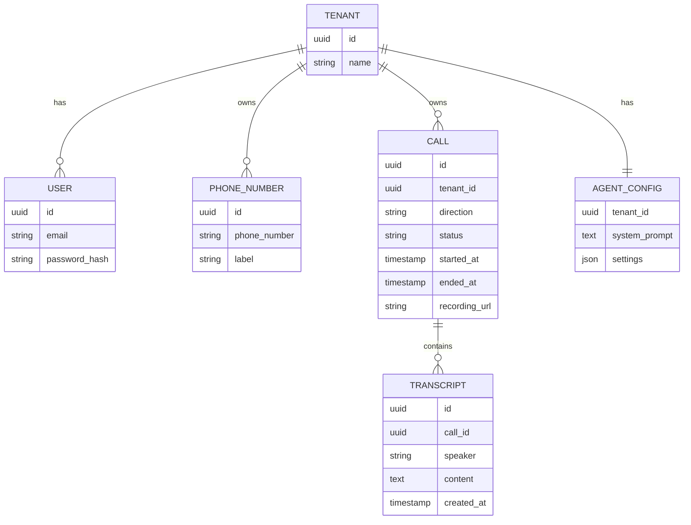

# 📄 Database & Data Model Design

**AI Voice Call Agent Platform (Multi-Tenant, Real-Time)**


## 1. 🧠 Overview

### 1.1 Purpose

This document defines:

* relational schema
* multi-tenant isolation strategy
* indexing & performance design
* data lifecycle for calls, transcripts, and settings


### 1.2 Database Choice

* Primary DB: PostgreSQL
* Hosting: Render managed PostgreSQL


## 2. 🏗️ High-Level Data Model




## 3. 🏢 Multi-Tenant Strategy (Critical)


### 3.1 Tenant Isolation

All tables include:

```sql
tenant_id UUID NOT NULL
```


### 3.2 Enforcement Rule

Every query must include:

```sql
WHERE tenant_id = :tenant_id
```


### 3.3 Backend Guarantee

* `tenant_id` extracted from JWT
* never trusted from client input


## 4. 📦 Core Tables


## 4.1 tenants

```sql
CREATE TABLE tenants (
    id UUID PRIMARY KEY,
    name TEXT NOT NULL,
    created_at TIMESTAMP DEFAULT NOW()
);
```


## 4.2 users

```sql
CREATE TABLE users (
    id UUID PRIMARY KEY,
    tenant_id UUID REFERENCES tenants(id),
    email TEXT UNIQUE NOT NULL,
    password_hash TEXT NOT NULL,
    created_at TIMESTAMP DEFAULT NOW()
);
```


## 4.3 phone_numbers

```sql
CREATE TABLE phone_numbers (
    id UUID PRIMARY KEY,
    tenant_id UUID REFERENCES tenants(id),
    phone_number TEXT NOT NULL,
    label TEXT,
    created_at TIMESTAMP DEFAULT NOW()
);
```


## 4.4 agent_configs

```sql
CREATE TABLE agent_configs (
    tenant_id UUID PRIMARY KEY REFERENCES tenants(id),
    system_prompt TEXT,
    settings JSONB,
    updated_at TIMESTAMP DEFAULT NOW()
);
```


## 4.5 calls

```sql
CREATE TABLE calls (
    id UUID PRIMARY KEY,
    tenant_id UUID REFERENCES tenants(id),

    direction TEXT CHECK (direction IN ('inbound', 'outbound')),
    status TEXT CHECK (status IN ('initiated','ringing','connected','completed','failed')),

    from_number TEXT,
    to_number TEXT,

    started_at TIMESTAMP,
    ended_at TIMESTAMP,

    recording_url TEXT,

    created_at TIMESTAMP DEFAULT NOW()
);
```


## 4.6 transcripts

```sql
CREATE TABLE transcripts (
    id UUID PRIMARY KEY,
    call_id UUID REFERENCES calls(id) ON DELETE CASCADE,

    speaker TEXT CHECK (speaker IN ('user', 'agent')),
    content TEXT NOT NULL,

    created_at TIMESTAMP DEFAULT NOW()
);
```


## 5. ⚡ Indexing Strategy


## 5.1 Critical Indexes

```sql
-- multi-tenant filtering
CREATE INDEX idx_calls_tenant ON calls(tenant_id);

-- call history
CREATE INDEX idx_calls_created_at ON calls(created_at DESC);

-- transcripts lookup
CREATE INDEX idx_transcripts_call_id ON transcripts(call_id);

-- fast timeline queries
CREATE INDEX idx_transcripts_call_time 
ON transcripts(call_id, created_at);
```


## 5.2 Why These Matter

| Query                | Index Used             |
| -------------------- | ---------------------- |
| call history         | tenant_id + created_at |
| transcripts per call | call_id                |
| ordered playback     | call_id + created_at   |


## 6. 🔁 Data Lifecycle


### 6.1 Call Creation

```sql
INSERT INTO calls (...)
```


### 6.2 During Call

👉 buffer transcripts in memory (fast)

Optional (for reliability):

```sql
INSERT INTO transcripts (...)
```


### 6.3 Call End

* finalize transcripts
* update status + end time

```sql
UPDATE calls SET status='completed', ended_at=NOW()
```


### 6.4 Recording Webhook

From Twilio:

```sql
UPDATE calls SET recording_url = :url
```


## 7. 📊 Query Patterns (Important)


### 7.1 Call History

```sql
SELECT *
FROM calls
WHERE tenant_id = :tenant_id
ORDER BY created_at DESC
LIMIT 20;
```


### 7.2 Call Detail + Transcript

```sql
SELECT *
FROM transcripts
WHERE call_id = :call_id
ORDER BY created_at ASC;
```


### 7.3 Dashboard Summary

```sql
SELECT status, COUNT(*)
FROM calls
WHERE tenant_id = :tenant_id
GROUP BY status;
```


## 8. 🧠 Optimization Strategy


### 8.1 Avoid Overwrites

* append-only transcripts
* immutable history


### 8.2 Batch Inserts (Optional)

```sql
INSERT INTO transcripts VALUES (...), (...), (...)
```


### 8.3 JSONB Usage

In `agent_configs.settings`:

```json
{
  "voice_id": "...",
  "speed": 1.0,
  "language": "en-SG"
}
```


## 9. 🔐 Security Design


### 9.1 Tenant Isolation

Strict enforcement:

```sql
WHERE tenant_id = :tenant_id
```


### 9.2 Password Security

* store hashed passwords (bcrypt)
* never store plaintext


## 10. 🚀 Migration Strategy (SQLite → PostgreSQL)


### 10.1 Why Start Simple

You can prototype with SQLite, then:


### 10.2 Migration Steps

1. dump schema
2. convert types (TEXT → proper types)
3. import into PostgreSQL
4. add indexes


## 11. 🔮 Future Enhancements


### 11.1 Scaling

* partition `calls` by date
* archive old transcripts


### 11.2 Analytics

Add table:

```sql
call_metrics (
  call_id,
  duration,
  latency_avg,
  interruption_count
)
```


### 11.3 Search

* full-text search on transcripts

```sql
CREATE INDEX idx_transcript_search
ON transcripts USING GIN(to_tsvector('english', content));
```


## 12. ✅ Summary

This database design:

* supports multi-tenant isolation
* enables fast real-time queries
* scales for production
* keeps schema simple for demo


# 🚀 Next Step

👉 [**API Contract Specification**](./5__API-Contract-Specification.md)

This is where everything becomes:

* concrete endpoints
* request/response schemas
* WebSocket protocols

