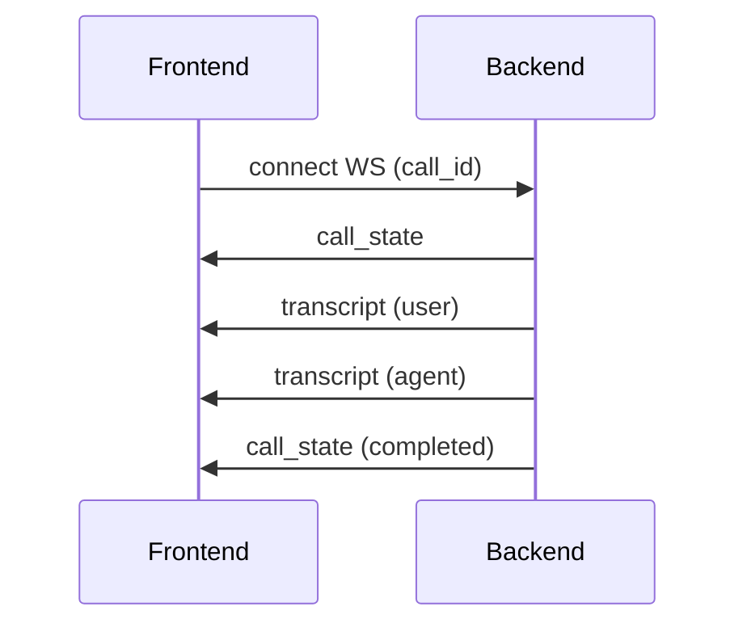

# 📄 API Contract Specification

**AI Voice Call Agent Platform (REST + WebSocket, Multi-Tenant)**


## 1. 🧠 Overview

### 1.1 Purpose

Defines all interfaces between:

* React frontend
* Backend (FastAPI)
* Real-time systems (WebSocket streams)


### 1.2 Protocols

| Type      | Usage                         |
| --------- | ----------------------------- |
| REST API  | configuration, calls, history |
| WebSocket | real-time transcripts & state |


### 1.3 Base URL

```text
https://api.yourdomain.com
```


## 2. 🔐 Authentication


### 2.1 Login

```http
POST /auth/login
```

#### Request

```json
{
  "email": "user@example.com",
  "password": "password123"
}
```


#### Response

```json
{
  "access_token": "jwt_token",
  "token_type": "bearer"
}
```


### 2.2 Auth Header

```http
Authorization: Bearer <token>
```


## 3. ⚙️ Settings API


### 3.1 Get Settings

```http
GET /settings
```

#### Response

```json
{
  "twilio": {
    "account_sid": "...",
    "phone_number": "..."
  },
  "elevenlabs": {
    "api_key": "...",
    "voice_id": "..."
  },
  "openai": {
    "api_key": "..."
  },
  "agent": {
    "system_prompt": "You are a helpful assistant..."
  }
}
```


### 3.2 Update Settings

```http
PUT /settings
```

#### Request

```json
{
  "twilio": {...},
  "elevenlabs": {...},
  "openai": {...},
  "agent": {
    "system_prompt": "..."
  }
}
```


## 4. 📞 Phone / Call API


### 4.1 Start Outbound Call

```http
POST /calls/outbound
```

#### Request

```json
{
  "to_number": "+6591234567",
  "from_number": "+6512345678"
}
```


#### Response

```json
{
  "call_id": "uuid",
  "status": "initiated"
}
```


### 4.2 Get Call History

```http
GET /calls
```

#### Query Params

```text
?limit=20&offset=0
```


#### Response

```json
[
  {
    "call_id": "uuid",
    "direction": "outbound",
    "status": "completed",
    "from_number": "...",
    "to_number": "...",
    "started_at": "...",
    "ended_at": "...",
    "recording_url": "..."
  }
]
```


### 4.3 Get Call Detail

```http
GET /calls/{call_id}
```


#### Response

```json
{
  "call_id": "uuid",
  "status": "completed",
  "transcripts": [
    {
      "speaker": "user",
      "text": "Hello",
      "timestamp": "..."
    },
    {
      "speaker": "agent",
      "text": "Hi, how can I help?",
      "timestamp": "..."
    }
  ],
  "recording_url": "..."
}
```


## 5. 📇 Phone Book API


### 5.1 Get Contacts

```http
GET /contacts
```


### 5.2 Create Contact

```http
POST /contacts
```

#### Request

```json
{
  "name": "John",
  "phone_number": "+6591234567"
}
```


### 5.3 Delete Contact

```http
DELETE /contacts/{id}
```


## 6. 🔌 WebSocket API (Real-Time)


## 6.1 Observer Stream


### Endpoint

```text
wss://api.yourdomain.com/ws/observe/{call_id}
```


### Auth

Send token via query:

```text
?token=JWT_TOKEN
```


## 6.2 Message Types


### 1. User Transcript

```json
{
  "type": "transcript",
  "speaker": "user",
  "text": "Hello, I want to ask something"
}
```


### 2. Agent Transcript

```json
{
  "type": "transcript",
  "speaker": "agent",
  "text": "Sure, how can I help?"
}
```


### 3. Partial Transcript (Optional)

```json
{
  "type": "partial_transcript",
  "speaker": "user",
  "text": "Hello I want..."
}
```


### 4. Call State

```json
{
  "type": "call_state",
  "state": "connected"
}
```


### 5. Agent Thinking Indicator

```json
{
  "type": "agent_thinking"
}
```


### 6. Error

```json
{
  "type": "error",
  "message": "Something went wrong"
}
```


## 7. 🔁 Twilio Webhooks (Internal API)


### 7.1 Incoming Call

```http
POST /incoming-call
```


### 7.2 Outbound Answer

```http
POST /outbound-answer
```


### 7.3 Recording Webhook

```http
POST /recording-webhook
```


#### Payload (example)

```json
{
  "call_sid": "...",
  "recording_url": "..."
}
```


## 8. 📡 WebSocket Lifecycle





## 9. ⚠️ Error Handling


### REST Errors

```json
{
  "error": "Unauthorized",
  "code": 401
}
```


### WebSocket Errors

```json
{
  "type": "error",
  "message": "Invalid call_id"
}
```


## 10. 🔐 Security Rules


* all REST endpoints require JWT
* WebSocket requires token
* tenant enforced server-side
* no client-provided tenant_id trusted


## 11. 🚀 Versioning Strategy


```text
/v1/...
```

Example:

```http
GET /v1/calls
```


## 12. ✅ Summary

This API spec provides:

* complete frontend-backend contract
* real-time transcript streaming
* clean separation of concerns
* scalable multi-tenant interface


# 🚀 Next Step

👉 [**Frontend System Design**](./6__Frontend-System-Design.md)

This will define:

* UI structure
* state management
* WebSocket handling
* UX (very important for demo)

