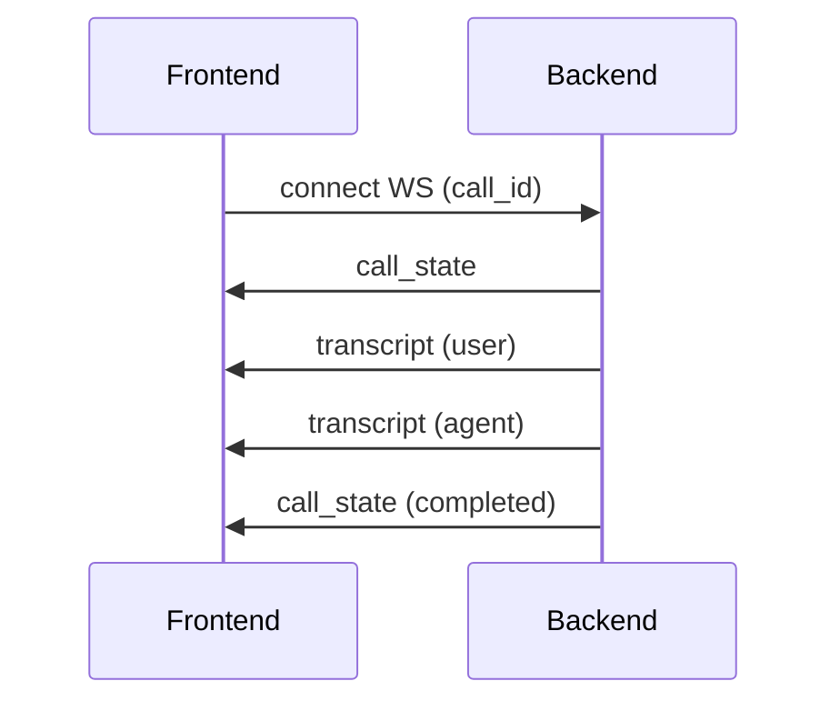

# 📄 API Contract Specification

**AI Voice Call Agent Platform (REST + WebSocket, Multi-Tenant)**


## 1. 🧠 Overview

### 1.1 Purpose

Defines all interfaces between:

* Next.js frontend
* Backend (FastAPI)
* Real-time systems (WebSocket streams)


### 1.2 Protocols

| Type      | Usage                         |
| --------- | ----------------------------- |
| REST API  | configuration, calls, history |
| WebSocket | real-time transcripts & state |


### 1.3 Base URL

```text
Frontend environment variable: NEXT_PUBLIC_API_BASE_URL
Default local value: http://localhost:8000/v1
```


## 2. 🔐 Authentication


### 2.0 Shared Auth Models

#### `AuthUser`

Returned by authenticated auth endpoints and `/auth/me`.

```json
{
  "email": "owner@example.com",
  "display_name": "Owner",
  "tenant_name": "Acme Workspace",
  "role": "Workspace owner",
  "email_verified": true,
  "avatar_url": "https://res.cloudinary.com/.../image/upload/...",
  "theme_preference": "system"
}
```

#### `TokenResponse`

```json
{
  "access_token": "jwt_token",
  "token_type": "bearer",
  "user": {
    "email": "owner@example.com",
    "display_name": "Owner",
    "tenant_name": "Acme Workspace",
    "role": "Workspace owner",
    "email_verified": true,
    "avatar_url": null,
    "theme_preference": "system"
  }
}
```

#### `MessageResponse`

```json
{
  "message": "Human-readable status message"
}
```

#### `UserPreferencesPayload`

```json
{
  "theme_preference": "system"
}
```


### 2.1 Signup

```http
POST /auth/signup
```

#### Request

```json
{
  "workspace_name": "Acme Workspace",
  "email": "owner@example.com",
  "password": "securepass123"
}
```

#### Validation Rules

* `workspace_name`: trimmed, minimum 2 characters, maximum 80 characters
* `email`: normalized to lowercase and validated as an email address
* `password`: 10 to 128 characters, must include at least one letter and one number, cannot start or end with whitespace

#### Response

```json
{
  "email": "owner@example.com",
  "message": "Check your inbox to verify your email before signing in.",
  "verification_required": true
}
```

#### Notes

* Signup creates the workspace owner account but does not sign the user in.
* The backend sends an email verification link after account creation.


### 2.2 Login

```http
POST /auth/login
```

#### Request

```json
{
  "email": "owner@example.com",
  "password": "securepass123"
}
```

#### Response

```json
{
  "access_token": "jwt_token",
  "token_type": "bearer",
  "user": {
    "email": "owner@example.com",
    "display_name": "Owner",
    "tenant_name": "Acme Workspace",
    "role": "Workspace owner",
    "email_verified": true,
    "avatar_url": null,
    "theme_preference": "system"
  }
}
```

#### Notes

* Login fails for unverified password accounts with `403 Forbidden`.
* Login fails for Google-only accounts with `400 Bad Request` and a message telling the client to continue with Google.

### 2.3 Google Sign-In

```http
POST /auth/google/signin
```

#### Request

```json
{
  "id_token": "google_identity_token"
}
```

#### Response

```json
{
  "access_token": "jwt_token",
  "token_type": "bearer",
  "user": {
    "email": "owner@example.com",
    "display_name": "Owner",
    "tenant_name": "Acme Workspace",
    "role": "Workspace owner",
    "email_verified": true,
    "avatar_url": null,
    "theme_preference": "system"
  }
}
```

#### Notes

* The Google token must be a browser-issued Google ID token.
* If the matching account exists but is still pending email verification, the backend marks it verified during Google sign-in.


### 2.4 Google Sign-Up

```http
POST /auth/google/signup
```

#### Request

```json
{
  "workspace_name": "Acme Workspace",
  "id_token": "google_identity_token"
}
```

#### Response

```json
{
  "access_token": "jwt_token",
  "token_type": "bearer",
  "user": {
    "email": "owner@example.com",
    "display_name": "Owner",
    "tenant_name": "Acme Workspace",
    "role": "Workspace owner",
    "email_verified": true,
    "avatar_url": null,
    "theme_preference": "system"
  }
}
```

#### Notes

* Google signup creates the workspace and signs the user in immediately.
* The backend stores the account as a Google-authenticated account, not a password-authenticated account.


### 2.5 Verify Email

```http
POST /auth/verify-email
```

#### Request

```json
{
  "token": "email_verification_token"
}
```

#### Response

```json
{
  "message": "Email verified. You can now sign in."
}
```

#### Notes

* The token is delivered in the verification link sent by email.
* Expired, reused, or invalid tokens return `400 Bad Request`.


### 2.6 Resend Verification Email

```http
POST /auth/resend-verification
```

#### Request

```json
{
  "email": "owner@example.com"
}
```

#### Response

```json
{
  "message": "If that account is awaiting verification, a new email has been sent."
}
```

#### Notes

* This endpoint intentionally returns the same success message whether or not the account exists or still needs verification.
* Successful responses use `202 Accepted`.


### 2.7 Forgot Password

```http
POST /auth/forgot-password
```

#### Request

```json
{
  "email": "owner@example.com"
}
```

#### Response

```json
{
  "message": "If that account can reset a password, a reset link has been sent."
}
```

#### Notes

* The response is intentionally generic to avoid revealing whether the account exists.
* Google-only accounts do not receive password reset links.
* Successful responses use `202 Accepted`.


### 2.8 Reset Password

```http
POST /auth/reset-password
```

#### Request

```json
{
  "token": "password_reset_token",
  "password": "newsecurepass123"
}
```

#### Validation Rules

* `token`: minimum 20 characters, maximum 255 characters
* `password`: same validation rules as signup

#### Response

```json
{
  "message": "Password updated. You can now sign in with your new password."
}
```

#### Notes

* Reset tokens are single-use and time-limited.
* Invalid, expired, or already-used tokens return `400 Bad Request`.


### 2.9 Current User

```http
GET /auth/me
```

#### Response

```json
{
  "email": "owner@example.com",
  "display_name": "Owner",
  "tenant_name": "Acme Workspace",
  "role": "Workspace owner",
  "email_verified": true,
  "avatar_url": null,
  "theme_preference": "system"
}
```


### 2.10 Upload Avatar

```http
POST /auth/avatar
```

#### Request

Content type:

```http
multipart/form-data
```

Form fields:

```text
file=<binary image upload>
```

#### Response

```json
{
  "email": "owner@example.com",
  "display_name": "Owner",
  "tenant_name": "Acme Workspace",
  "role": "Workspace owner",
  "email_verified": true,
  "avatar_url": "https://res.cloudinary.com/.../image/upload/...",
  "theme_preference": "system"
}
```

#### Notes

* The backend validates and normalizes the image before storing it.
* Validation failures return `400 Bad Request`.
* Storage-provider failures return `503 Service Unavailable`.


### 2.11 Delete Avatar

```http
DELETE /auth/avatar
```

#### Response

```json
{
  "email": "owner@example.com",
  "display_name": "Owner",
  "tenant_name": "Acme Workspace",
  "role": "Workspace owner",
  "email_verified": true,
  "avatar_url": null,
  "theme_preference": "system"
}
```


### 2.12 Get Preferences

```http
GET /auth/preferences
```

#### Response

```json
{
  "theme_preference": "system"
}
```


### 2.13 Update Preferences

```http
PUT /auth/preferences
```

#### Request

```json
{
  "theme_preference": "dark"
}
```

Allowed values:

* `light`
* `dark`
* `system`

#### Response

```json
{
  "theme_preference": "dark"
}
```


### 2.14 Auth Header

```http
Authorization: Bearer <token>
```


### 2.15 Common Auth Error Shapes

Most auth errors are returned by FastAPI as:

```json
{
  "detail": "Human-readable error message"
}
```

Validation errors use FastAPI's structured `detail` array:

```json
{
  "detail": [
    {
      "loc": ["body", "email"],
      "msg": "value is not a valid email address",
      "type": "value_error"
    }
  ]
}
```


### 2.16 Common Auth Status Codes

* `200 OK` for successful reads, login, verification, reset, avatar delete, and preferences update
* `201 Created` for password signup and Google signup
* `202 Accepted` for resend verification and forgot password
* `400 Bad Request` for invalid tokens, unsupported auth mode, invalid avatar upload, or validation failures caught by route logic
* `401 Unauthorized` for invalid login credentials or missing bearer token on protected endpoints
* `403 Forbidden` for unverified password-account sign-in attempts
* `404 Not Found` when Google sign-in is attempted for an email with no existing account
* `409 Conflict` when signup attempts to create an already-existing account
* `503 Service Unavailable` for SMTP delivery failures, Google identity provider unavailability, or avatar storage failures


## 3. ⚙️ Settings API


### 3.1 Get Settings

```http
GET /settings
```

#### Response

```json
{
  "twilio": {
    "account_sid": "...",
    "phone_number": "..."
  },
  "elevenlabs": {
    "api_key": "...",
    "voice_id": "..."
  },
  "openai": {
    "api_key": "..."
  },
  "agent": {
    "system_prompt": "You are a helpful assistant..."
  }
}
```


### 3.2 Update Settings

```http
PUT /settings
```

#### Request

```json
{
  "twilio": {...},
  "elevenlabs": {...},
  "openai": {...},
  "agent": {
    "system_prompt": "..."
  }
}
```


## 4. 📞 Phone / Call API


### 4.1 Start Outbound Call

```http
POST /calls/outbound
```

#### Request

```json
{
  "to_number": "+6591234567",
  "from_number": "+6512345678"
}
```


#### Response

```json
{
  "call_id": "uuid",
  "status": "initiated"
}
```


### 4.2 Get Call History

```http
GET /calls
```

#### Query Params

```text
?limit=20&offset=0
```


#### Response

```json
[
  {
    "call_id": "uuid",
    "direction": "outbound",
    "status": "completed",
    "from_number": "...",
    "to_number": "...",
    "started_at": "...",
    "ended_at": "...",
    "recording_url": "..."
  }
]
```


### 4.3 Get Call Detail

```http
GET /calls/{call_id}
```


#### Response

```json
{
  "call_id": "uuid",
  "status": "completed",
  "started_at": "...",
  "to_number": "+6591234567",
  "transcripts": [
    {
      "speaker": "user",
      "text": "Hello",
      "timestamp": "..."
    },
    {
      "speaker": "agent",
      "text": "Hi, how can I help?",
      "timestamp": "..."
    }
  ],
  "recording_url": "..."
}
```


### 4.4 End Active Call

```http
POST /calls/{call_id}/end
```


#### Response

```json
{
  "call_id": "uuid",
  "status": "completed"
}
```


## 5. 📇 Phone Book API


### 5.1 Get Contacts

```http
GET /contacts
```


### 5.2 Create Contact

```http
POST /contacts
```


#### Request

```json
{
  "name": "Demo Lead",
  "phone_number": "+6591234567"
}
```


#### Response

```json
{
  "id": "uuid",
  "name": "Demo Lead",
  "phone_number": "+6591234567"
}
```


### 5.3 Delete Contact

```http
DELETE /contacts/{contact_id}
```


#### Response

```http
204 No Content
```


## 6. 👀 Observer WebSocket API


### 6.1 Connect Observer Stream

```text
GET /ws/observe/{call_id}?token=<jwt>
```


### 6.2 Event Types Used by the Frontend

#### `call_state`

```json
{
  "type": "call_state",
  "state": "initiated"
}
```


#### `agent_thinking`

```json
{
  "type": "agent_thinking"
}
```


#### `partial_transcript`

```json
{
  "type": "partial_transcript",
  "text": "Hello, I wanted to ask..."
}
```


#### `transcript`

```json
{
  "type": "transcript",
  "speaker": "agent",
  "text": "How can I help?",
  "timestamp": "2026-04-10T10:20:30Z"
}
```


#### `error`

```json
{
  "type": "error",
  "message": "Observer connection failed."
}
```

```http
POST /contacts
```

#### Request

```json
{
  "name": "John",
  "phone_number": "+6591234567"
}
```


### 5.3 Delete Contact

```http
DELETE /contacts/{id}
```


## 6. 🔌 WebSocket API (Real-Time)


## 6.1 Observer Stream


### Endpoint

```text
wss://api.yourdomain.com/ws/observe/{call_id}
```


### Auth

Send token via query:

```text
?token=JWT_TOKEN
```


## 6.2 Message Types


### 1. User Transcript

```json
{
  "type": "transcript",
  "speaker": "user",
  "text": "Hello, I want to ask something"
}
```


### 2. Agent Transcript

```json
{
  "type": "transcript",
  "speaker": "agent",
  "text": "Sure, how can I help?"
}
```


### 3. Partial Transcript (Optional)

```json
{
  "type": "partial_transcript",
  "speaker": "user",
  "text": "Hello I want..."
}
```


### 4. Call State

```json
{
  "type": "call_state",
  "state": "connected"
}
```


### 5. Agent Thinking Indicator

```json
{
  "type": "agent_thinking"
}
```


### 6. Error

```json
{
  "type": "error",
  "message": "Something went wrong"
}
```


## 7. 🔁 Twilio Webhooks (Internal API)


### 7.1 Incoming Call

```http
POST /incoming-call
```


### 7.2 Outbound Answer

```http
POST /outbound-answer
```


### 7.3 Recording Webhook

```http
POST /recording-webhook
```


#### Payload (example)

```json
{
  "call_sid": "...",
  "recording_url": "..."
}
```


## 8. 📡 WebSocket Lifecycle





## 9. ⚠️ Error Handling


### REST Errors

```json
{
  "error": "Unauthorized",
  "code": 401
}
```


### WebSocket Errors

```json
{
  "type": "error",
  "message": "Invalid call_id"
}
```


## 10. 🔐 Security Rules


* all REST endpoints require JWT
* WebSocket requires token
* tenant enforced server-side
* no client-provided tenant_id trusted


## 11. 🚀 Versioning Strategy


```text
/v1/...
```

Example:

```http
GET /v1/calls
```


## 12. ✅ Summary

This API spec provides:

* complete frontend-backend contract
* real-time transcript streaming
* clean separation of concerns
* scalable multi-tenant interface


# 🚀 Next Step

👉 [**Frontend System Design**](./6__Frontend-System-Design.md)

This will define:

* UI structure
* state management
* WebSocket handling
* UX (very important for demo)

