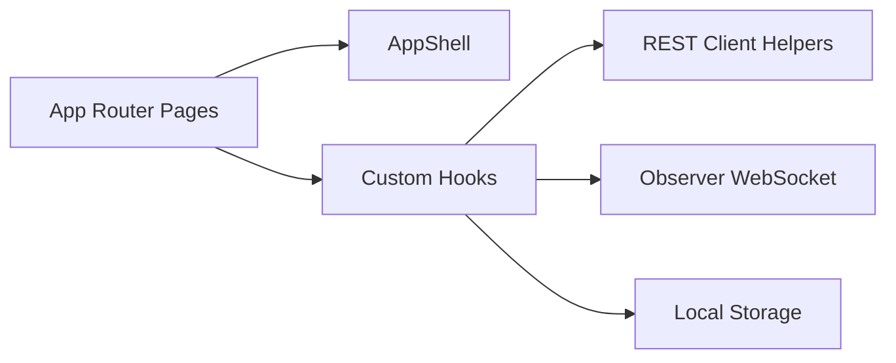

# Frontend System Design

**AI Voice Call Agent Dashboard (Next.js App Router + TypeScript + Bun)**

## 1. Overview

### 1.1 Purpose

The frontend is a browser-based operator console for:

- authenticating into the demo workspace
- launching monitored outbound calls
- observing live transcripts over WebSocket
- reviewing archived calls and transcripts
- editing tenant settings
- managing account profile, subscription summary, and theme preference

### 1.2 Current Tech Stack

- Framework: Next.js 15 App Router
- UI runtime: React 19 client components
- Language: TypeScript
- Package manager/runtime: Bun
- Styling: Tailwind CSS v4 with CSS-variable theme tokens and `next/font`
- Real-time transport: WebSocket observer channel
- State model: React state and custom hooks

## 2. High-Level Architecture



## 3. Application Structure

### 3.1 Route Structure

```text
/               → Login page
/home           → Overview dashboard
/phone          → Outbound call desk + observer transcript
/history        → Call archive + transcript detail
/settings       → Tenant configuration
/profile        → Account profile summary
/preferences    → Theme preferences
/subscription   → Mocked plan and usage page
```

### 3.2 Shared Layout Strategy

- The login page is a standalone route with its own centered auth shell.
- All authenticated routes render inside `AppShell`.
- `AppShell` provides the desktop sidebar, mobile top bar, mobile drawer, account menus, and sign-out modal.
- Sidebar collapse state is persisted in localStorage.

## 4. Core Frontend Modules

### 4.1 Root layout

`app/layout.tsx` is responsible for:

- loading the global fonts
- registering metadata and icons
- loading `globals.css`
- applying the shared font family to the document body

### 4.2 Authentication route

`app/page.tsx` is responsible for:

- collecting email and password
- calling `POST /auth/login`
- storing the JWT in localStorage through `lib/auth.ts`
- redirecting successful logins to `/home`
- exposing a top-right theme toggle for light, dark, and system preference

### 4.3 Shared application shell

`components/layout/AppShell.tsx` handles:

- route-aware primary navigation
- route-aware account navigation for `/profile`, `/preferences`, and `/subscription`
- desktop and mobile account menus
- sign-out confirmation flow
- responsive navigation behavior
- page-title updates based on the active route

### 4.4 Phone experience

The phone screen is split into two main surfaces:

- `CallPanel.tsx`: starts outbound calls from the contact list and ends the active call
- `TranscriptView.tsx`: shows live transcript messages, partial transcript text, call state, and elapsed timer

`CallHistoryList.tsx` complements the live phone experience by keeping recent call context visible beside the active observer stream.

### 4.5 Settings and account pages

- `settings/page.tsx`: edits Twilio, voice provider, OpenAI, and system prompt values
- `history/page.tsx`: loads call summaries and a detail transcript panel
- `profile/page.tsx`: displays the current operator and workspace summary
- `preferences/page.tsx`: lets the operator choose light, dark, or system theme behavior
- `subscription/page.tsx`: shows mocked billing and usage stats for the MVP

## 5. State and Hook Design

### 5.1 `useAuth`

- owns login state and token hydration
- exposes `signIn` used by the login page
- uses `sagent.token` in localStorage

### 5.2 `useCall`

- loads calls and contacts on mount
- loads the selected call detail transcript
- starts outbound calls through `POST /calls/outbound`
- ends active calls through `POST /calls/{callId}/end`
- opens the observer WebSocket when `activeCallId` is set
- refreshes lists when calls complete

### 5.3 `useThemePreference`

- exposes `themePreference`, `resolvedTheme`, `setThemePreference`, and `cycleThemePreference`
- persists under `sagent.theme`
- writes the active theme to `document.documentElement.dataset.theme`
- supports live OS theme changes while in `system` mode

## 6. Visual System

### 6.1 Styling approach

- Tailwind CSS v4 is the primary styling layer for pages, the app shell, and shared phone components.
- `app/globals.css` is limited to theme variables and base document rules.
- `lib/ui.ts` holds shared Tailwind class recipes for reusable UI patterns.
- The design system still uses CSS variables for surfaces, text, borders, brand colors, and shadows.

### 6.2 Typography

- Headings and body text use Space Grotesk through `next/font`.
- IBM Plex Mono is available for compact monospace accents.
- The root font size is slightly reduced so the dashboard feels denser and more operator-oriented.

### 6.3 Theme system

- Light and dark palettes are defined at the root level.
- The login route and dashboard share the same theme variables.
- The preferences page is the explicit destination for choosing theme mode.
- The login page also exposes a quick theme toggle before sign-in.

## 7. Realtime Observer Design

### 7.1 WebSocket connection

The frontend derives the observer URL from `NEXT_PUBLIC_API_BASE_URL`:

```ts
const ws = new WebSocket(
  `${wsBase}/ws/observe/${callId}?token=${encodeURIComponent(token)}`
);
```

### 7.2 Event handling

`useCall` currently handles these events:

- `call_state`: updates the status pill and closes the active observer when the call completes
- `agent_thinking`: moves the UI into a thinking state
- `partial_transcript`: updates the temporary in-progress user transcript
- `transcript`: appends a final transcript message to the stream
- `error`: surfaces the observer error to the page

### 7.3 Transcript rendering rules

- user and agent messages render as separate message cards
- partial transcript text is displayed as a temporary user card
- the transcript view auto-scrolls to the latest content
- elapsed call duration updates every second while the page is open

## 8. Frontend Constraints and Extension Points

- Auth is still browser-local and intentionally simple for the MVP.
- Account pages are currently read-mostly shells, but the routes and navigation state are already in place for future expansion.
- Billing is simulated on the subscription page.
- Inbound-call-specific UI is not yet implemented in the current frontend; the shipped phone UX is focused on monitored outbound calls and transcript observation.

