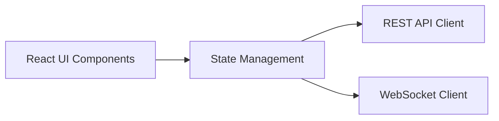
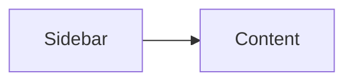
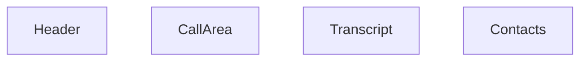
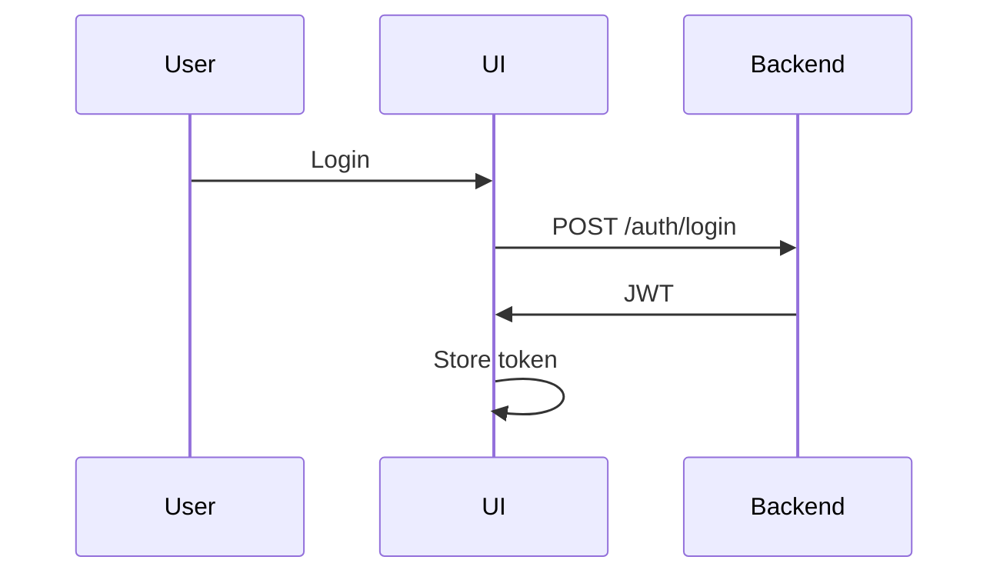

# 📄 Frontend System Design

**AI Voice Call Agent Dashboard (React + TypeScript)**


## 1. 🧠 Overview

### 1.1 Purpose

The frontend provides a **dashboard interface** for:

* managing AI voice agent settings
* initiating and receiving calls
* monitoring live conversations (transcripts)
* reviewing call history


### 1.2 Tech Stack

* Framework: React (TypeScript)
* State: React Query + local state
* Styling: Tailwind CSS (recommended)
* Real-time: WebSocket


## 2. 🏗️ High-Level Architecture




## 3. 📐 Application Structure


## 3.1 Page Structure

```text
App
├── Auth (Login)
├── Dashboard Layout
│   ├── Sidebar
│   ├── Home Page
│   ├── Phone Page
│   └── Settings Page
```


## 3.2 Routing

```text
/            → Login
/home        → Dashboard
/phone       → Call interface
/settings    → Config
```


## 4. 🧩 Core Components


## 4.1 Layout



### Sidebar

* Home
* Phone
* Settings


## 4.2 Home Page

### Purpose

* entry point
* navigation cards


### UI Elements

```text
[ Settings Card ]
[ Phone Card ]
```


## 4.3 Settings Page


### Sections

#### 1. Twilio Config

#### 2. ElevenLabs Config

#### 3. OpenAI Config

#### 4. Agent Prompt (Important)


### Agent Prompt UI

```text
[ Textarea ]
"You are a helpful Singapore call assistant..."
```


## 4.4 Phone Page (Core UX)

This is your **main demo screen**


### 4.4.1 Layout




### 4.4.2 States

| State       | UI                |
| ----------- | ----------------- |
| Idle        | call history      |
| Calling     | ringing UI        |
| Active Call | transcript stream |
| Ended       | history view      |


## 5. 📞 Call Interface Design


## 5.1 Idle State

```text
[ Contact List ]
[ Call History ]
```


## 5.2 Calling State

```text
Calling +65 XXXX...
[ Cancel Button ]
```


## 5.3 Active Call State (Critical)


### Layout

```text
----------------------📞 Call in Progress

[ Status: Listening / Thinking / Speaking ]

----------------------Transcript:

User: Hello
Agent: Hi, how can I help?

----------------------[ End Call Button ]
```


## 6. 💬 Transcript UI Design


## 6.1 Chat Style

```text
(User - right)
Hello, I want to ask...

(Agent - left)
Sure, how can I help?
```


## 6.2 Message Model

```ts
type Message = {
  speaker: "user" | "agent";
  text: string;
  timestamp: number;
};
```


## 6.3 Auto Scroll

* scroll to latest message
* smooth animation


## 6.4 Partial Transcript Handling

* update last message dynamically


## 7. ⚡ Real-Time WebSocket Design


## 7.1 Connection

```ts
const ws = new WebSocket(
  `wss://api/ws/observe/${callId}?token=${token}`
);
```


## 7.2 Event Handling

```ts
ws.onmessage = (event) => {
  const data = JSON.parse(event.data);

  switch (data.type) {
    case "transcript":
      addMessage(data);
      break;

    case "partial_transcript":
      updatePartial(data);
      break;

    case "call_state":
      setCallState(data.state);
      break;

    case "agent_thinking":
      setThinking(true);
      break;
  }
};
```


## 7.3 Cleanup

```ts
ws.close();
```


## 8. 🔁 State Management


## 8.1 Global State

```ts
{
  user,
  token,
  currentCall,
  callState,
  messages
}
```


## 8.2 Server State (React Query)

* call history
* settings
* contacts


## 9. 📡 API Integration Layer


## 9.1 Example

```ts
const startCall = async (data) => {
  return fetch("/calls/outbound", {
    method: "POST",
    headers: { Authorization: `Bearer ${token}` },
    body: JSON.stringify(data),
  });
};
```


## 10. 🎯 UX Enhancements (Important)


## 10.1 Status Indicator

```text
🟢 Listening
🟡 Thinking
🔵 Speaking
```


## 10.2 Typing Indicator

```text
Agent is thinking...
```


## 10.3 Call Timer

```text
00:01:23
```


## 10.4 Error Display

```text
Connection lost. Reconnecting...
```


## 11. 📊 Call History UI


## 11.1 List

```text
+65 XXX → Completed
+65 XXX → Missed
```


## 11.2 Detail View

* transcript
* recording playback (from Twilio)


## 12. 🔐 Authentication Flow





## 13. 🚀 Performance Considerations


* debounce UI updates
* batch state updates
* avoid unnecessary re-renders


## 14. 🔮 Future Enhancements


* audio playback (optional)
* analytics dashboard
* multi-agent management
* dark mode


## 15. ✅ Summary

The frontend system:

* provides real-time call monitoring
* streams live transcripts via WebSocket
* manages agent configuration
* delivers clean, intuitive UX


# 🚀 FINAL STEP

👉 [**Sequence & Interaction Design**](./7__Sequence-Interaction-Design.md)

* shows full system flow
* ties everything together

