# 📄 Sequence & Interaction Design

**AI Voice Call Agent Platform (End-to-End Flows)**

## 1. 🧠 Overview

### 1.1 Purpose

Defines **end-to-end interaction flows** across:

* Frontend (Next.js App Router client)
* Backend (FastAPI)
* Telephony via Twilio
* AI Engine (STT + LLM + TTS via OpenAI + ElevenLabs)
* Database (PostgreSQL)

## 2. 🔐 Authentication Flow

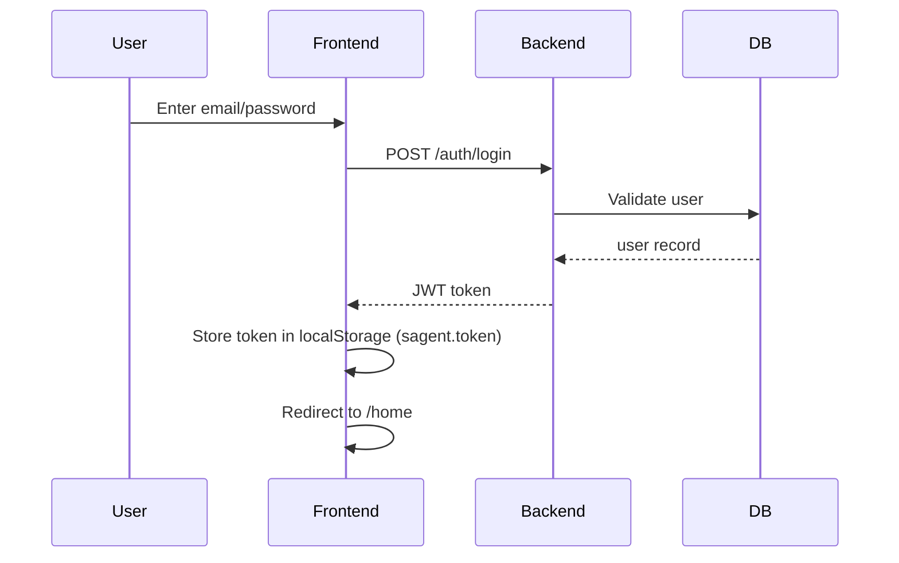

## 3. 📞 Outbound Call Flow (Core Demo)

## 3.1 High-Level Flow

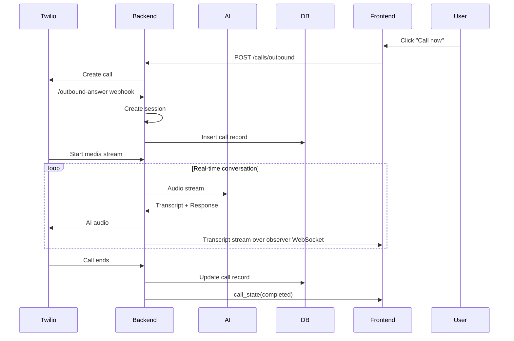

## 3.2 Detailed Real-Time Loop

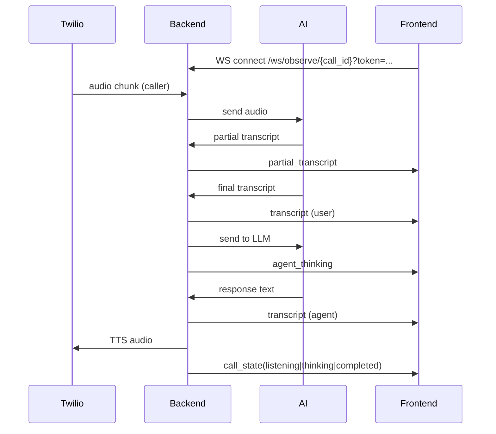

## 4. 📲 Inbound Call Flow

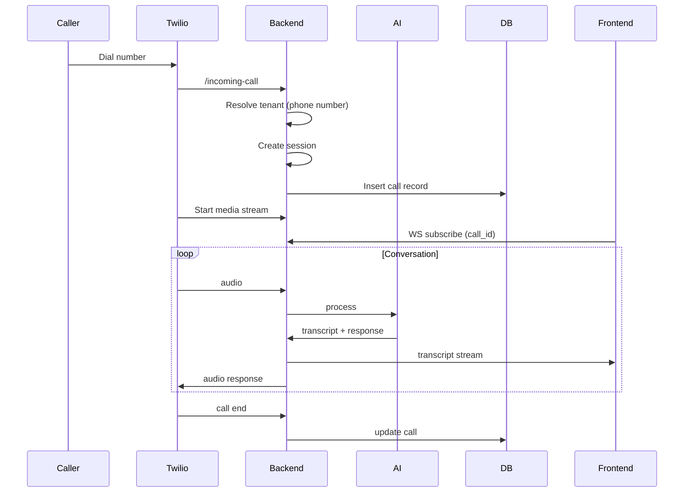

## 5. 💬 Frontend Observer Flow

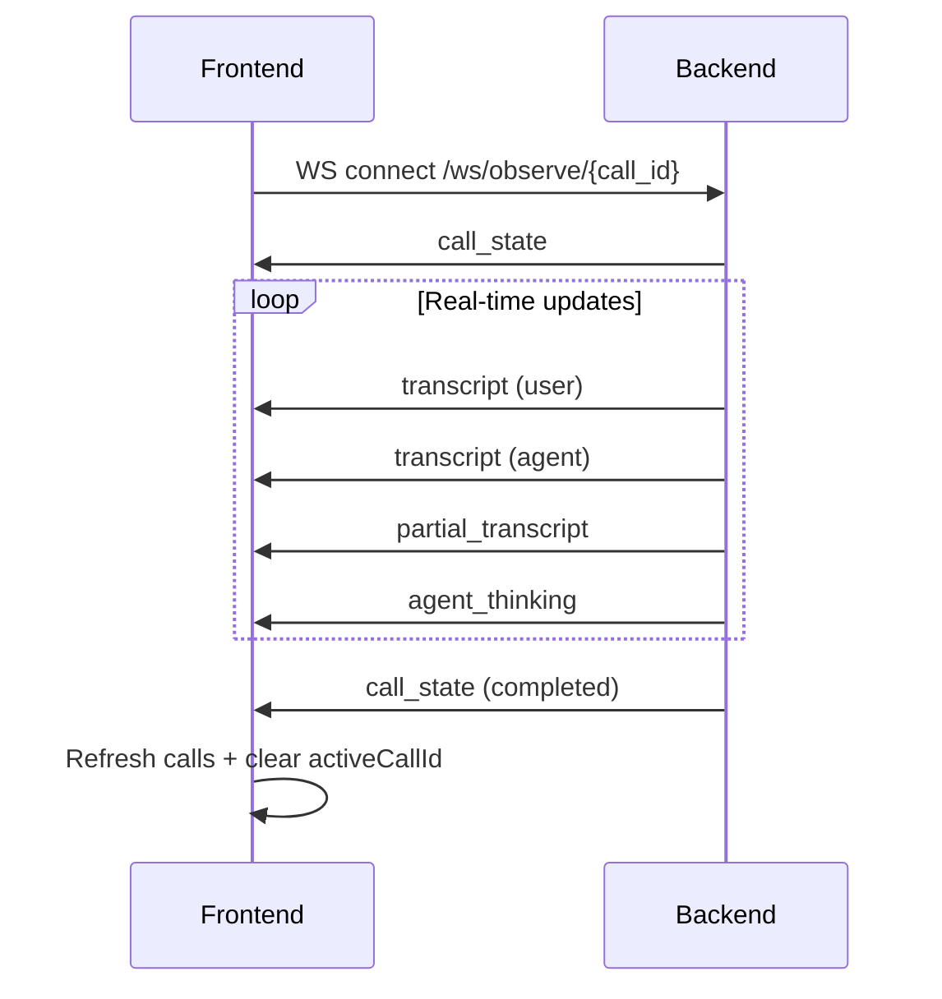

## 6. ⚙️ Settings Update Flow

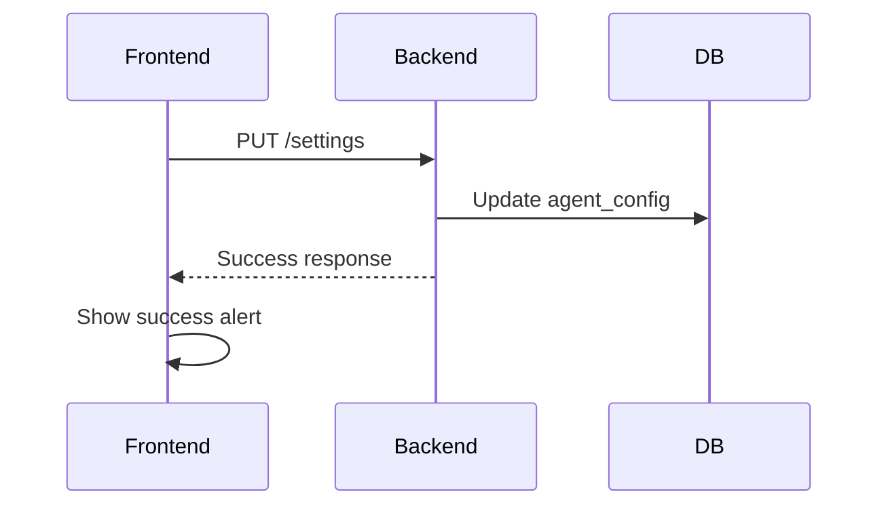

## 7. 📊 Call History Flow

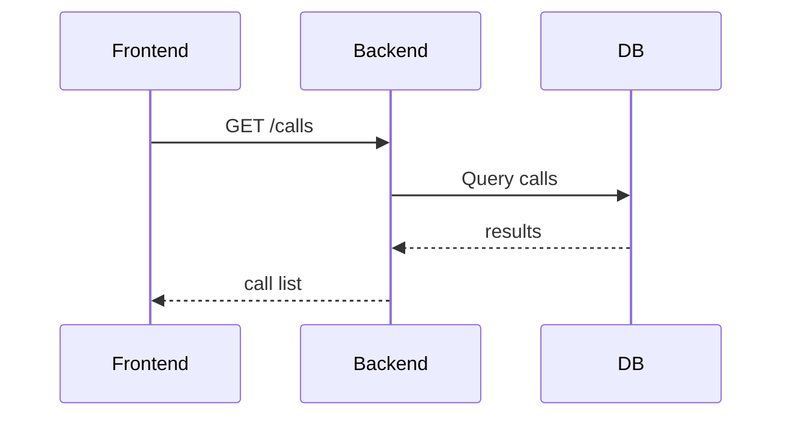

## 8. 📄 Call Detail Flow

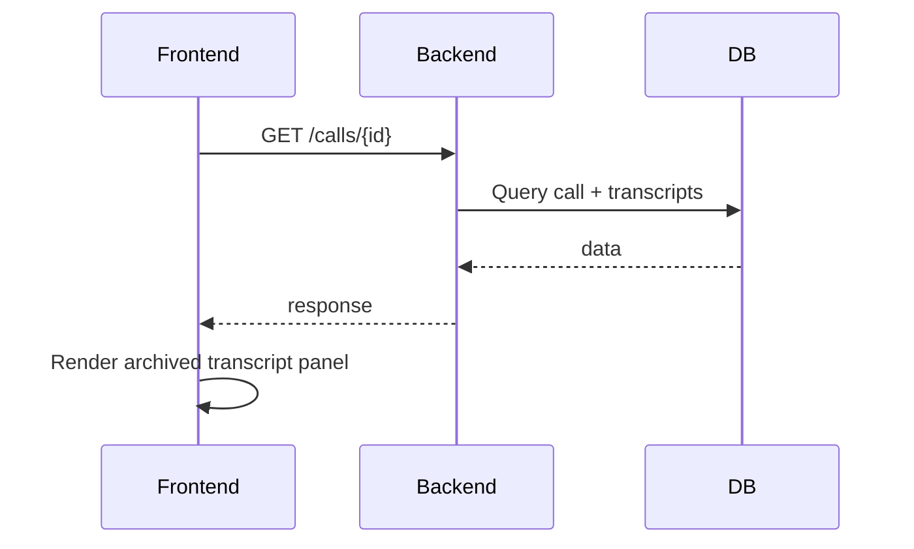

## 8.1 Account Navigation Flow

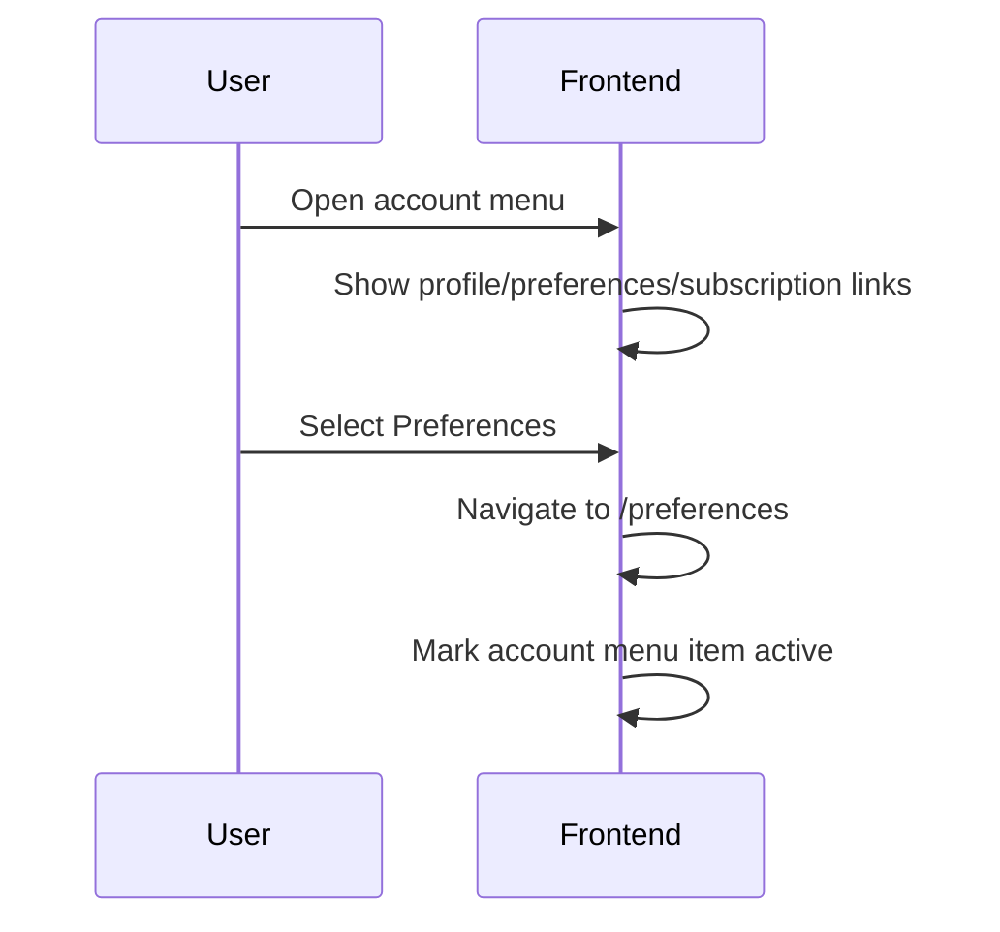

## 8.2 Theme Preference Flow

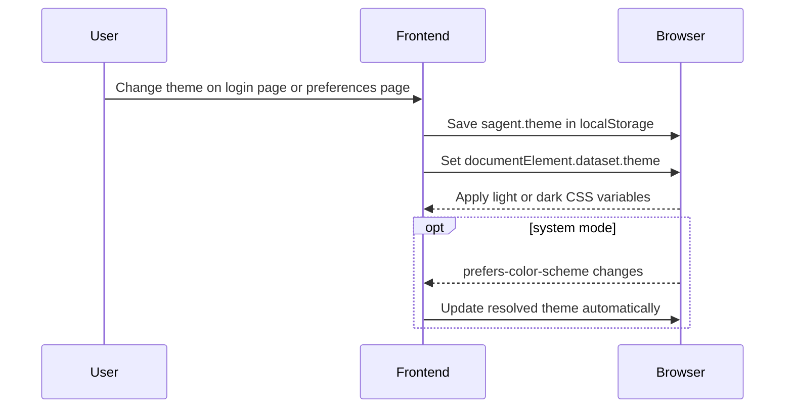

## 9. 🎙️ Recording Webhook Flow

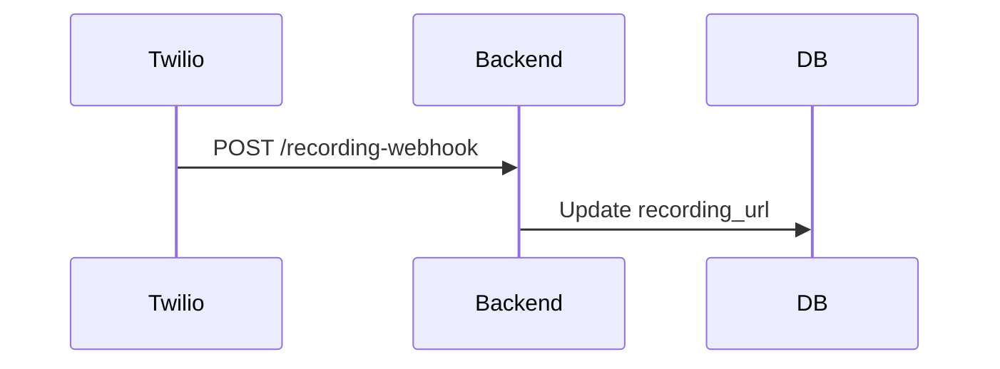

## 10. 🔁 Session Lifecycle Flow

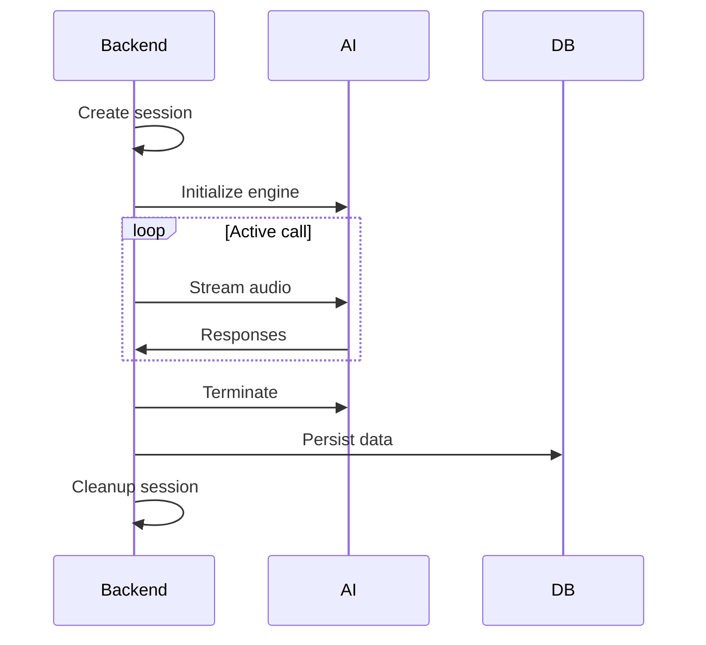

## 11. 🧠 Turn-Taking (Critical Interaction)

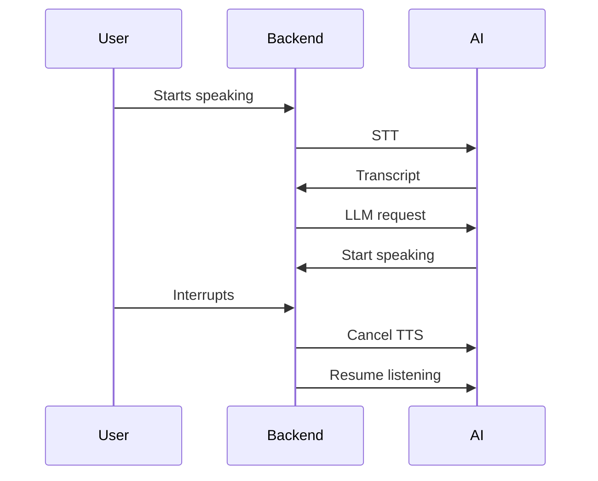

## 12. ⚠️ Error Handling Flow

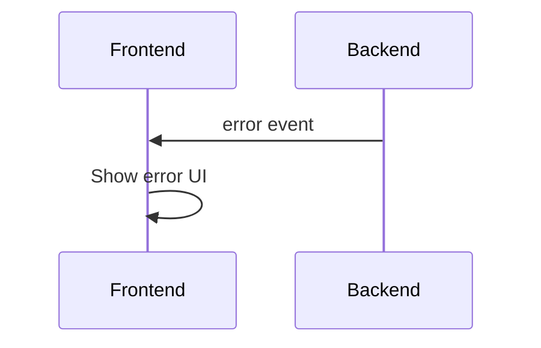

## 13. 🧩 End-to-End System Flow (Condensed)

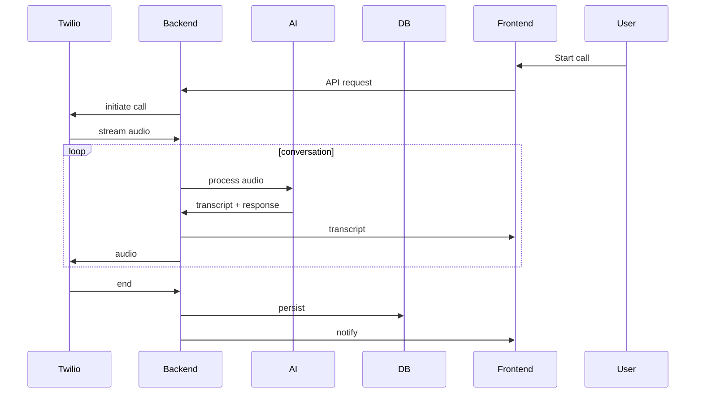

About Source Code

- [Backend README](../backend/README.md)
- [Frontend README](../frontend/README.md)