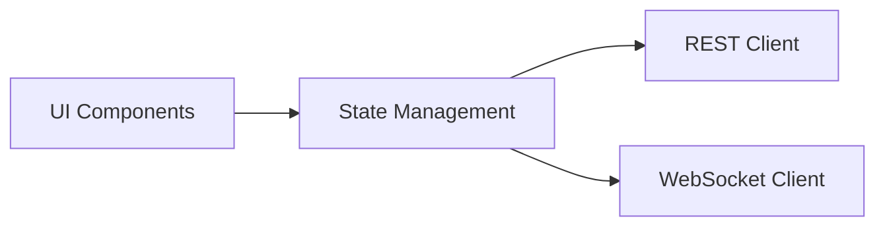
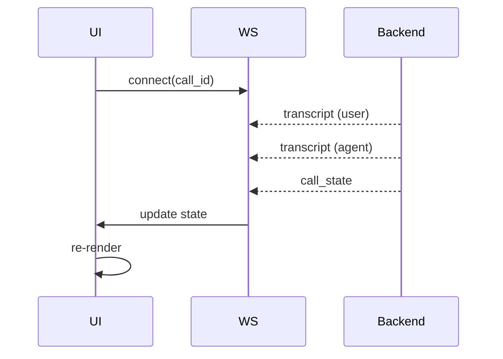
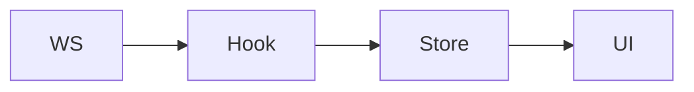
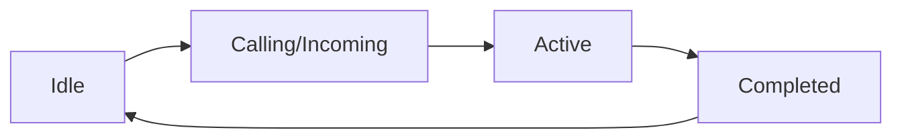

# 🎨 Frontend Architecture Overview

This frontend is built with **React + TypeScript** and designed for:

* real-time call monitoring (WebSocket)
* clean UI/UX for AI voice interactions
* modular, scalable component architecture


## 🏗️ High-Level Architecture




## 📁 Project Structure

```text
src/
├── main.tsx
├── App.tsx
├── pages/
├── components/
├── hooks/
├── services/
├── store/
├── types/
├── utils/
└── styles/
```


# 📦 Folder Responsibilities


## 🚀 `main.tsx` — Entry Point

**Role:**

* bootstraps React app
* mounts root component


## 🧭 `App.tsx` — Root Component

**Responsibilities:**

* routing configuration
* global layout wrapper


## 📄 `pages/` — Route-Level Views

```text
pages/
├── Login.tsx
├── Home.tsx
├── Phone.tsx
└── Settings.tsx
```


### Responsibilities

* represent full pages (routes)
* compose smaller components
* manage page-level logic


### Key Page: `Phone.tsx`

This is the **core demo screen**:

* call initiation
* live transcript display
* call state visualization


## 🧩 `components/` — Reusable UI Components

```text
components/
├── layout/
├── phone/
├── settings/
└── common/
```


### 1. `layout/`

* Sidebar
* Header


### 2. `phone/` (Core UI)

```text
phone/
├── CallPanel.tsx
├── TranscriptView.tsx
├── CallControls.tsx
└── CallStatus.tsx
```


**Responsibilities:**

* call UI rendering
* transcript display
* call controls (start/end)
* status indicators


### 3. `settings/`

* API credential forms
* agent prompt configuration


### 4. `common/`

* buttons
* cards
* loaders


## 🔗 `hooks/` — Custom React Hooks

```text
hooks/
├── useAuth.ts
├── useCall.ts
├── useWebSocket.ts
└── useTranscript.ts
```


### Responsibilities

Encapsulate reusable logic:

* authentication state
* call lifecycle
* WebSocket connection
* transcript handling


### Example

```ts
useWebSocket(callId)
```

Handles:

* connection
* reconnection
* message parsing


## 📡 `services/` — API Layer

```text
services/
├── api.ts
├── auth.ts
├── calls.ts
└── settings.ts
```


### Responsibilities

* REST API calls
* request abstraction
* auth headers injection


### Example

```ts
startCall(data)
getCallHistory()
```


## 🗄️ `store/` — Global State

```text
store/
├── authStore.ts
├── callStore.ts
└── uiStore.ts
```


### Responsibilities

* global app state
* shared across components


### Typical State

```ts
{
  user,
  token,
  currentCall,
  callState,
  messages
}
```


## 🧾 `types/` — Type Definitions

```text
types/
├── api.ts
├── call.ts
└── transcript.ts
```


### Responsibilities

* TypeScript interfaces
* API contract alignment


### Example

```ts
type Message = {
  speaker: "user" | "agent";
  text: string;
};
```


## 🧰 `utils/` — Utility Functions


### Responsibilities

* formatting helpers
* constants
* small reusable logic


## 🎨 `styles/` — Styling


* global CSS
* Tailwind config (if used)


# 🔄 Real-Time Data Flow (Critical)


## WebSocket Interaction




## Transcript Rendering Flow




# 📞 Call State Flow





## UI Behavior

| State     | UI              |
| --------- | --------------- |
| Idle      | call history    |
| Calling   | ringing screen  |
| Active    | live transcript |
| Completed | summary view    |


# 🎯 Key Design Principles


## 1. Component Separation

* pages = layout
* components = UI
* hooks = logic


## 2. Real-Time First

* WebSocket isolated in hooks
* UI reacts to state updates


## 3. Clean Data Flow

```text
WebSocket → Hook → Store → UI
```


## 4. Scalability

* easy to add new pages
* easy to extend call features
* reusable hooks


# ✅ Summary

This frontend architecture:

* supports **real-time transcript streaming**
* provides **clean, modular UI components**
* ensures **scalable and maintainable codebase**
* aligns tightly with backend API & WebSocket design
