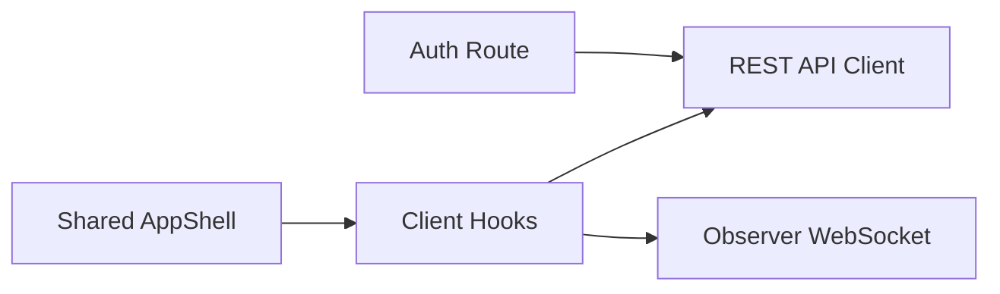

# Frontend Architecture Overview

The frontend is built with Next.js App Router, React 19, TypeScript, and Bun. It ships a browser-based operator console for email sign-in and sign-up, starting outbound calls, watching the live observer stream, reviewing history, editing account settings, and managing account-level preferences such as color theme.

## Local Development

This package is managed with Bun.

### Install dependencies

```bash
bun install
```

### Run the app

```bash
bun run dev
```

### Environment

Copy `.env.local.example` to `.env.local` and set the backend base URL.

```bash
cp .env.local.example .env.local
```

```env
NEXT_PUBLIC_API_BASE_URL=http://localhost:8000/v1
NEXT_PUBLIC_GOOGLE_CLIENT_ID=
```

## High-Level Architecture



## Current Route Map

```text
/               → email sign-in / sign-up
/signin         → dedicated email and Google sign-in
/signup         → dedicated email and Google sign-up
/verify-email   → verification completion and resend flow
/forgot-password → password reset request form
/reset-password → new password form from reset email
/home           → dashboard overview
/phone          → outbound call desk + transcript observer
/history        → call archive + detail transcript view
/settings       → account configuration form
/profile        → account profile summary
/preferences    → color theme preferences
/subscription   → mocked plan and usage summary
```

## Project Structure

```text
app/
├── tailwind.css
├── layout.tsx
├── page.tsx
├── home/page.tsx
├── phone/page.tsx
├── history/page.tsx
├── settings/page.tsx
├── profile/page.tsx
├── preferences/page.tsx
└── subscription/page.tsx

components/
├── layout/AppShell.tsx
├── layout/app-shell/
└── phone/
    ├── CallHistoryList.tsx
    ├── CallPanel.tsx
    └── TranscriptView.tsx

hooks/
├── useAuth.ts
├── useCall.ts
└── useThemePreference.ts

lib/
├── ui.ts
├── api.ts
└── auth.ts

types/

postcss.config.mjs
```

## Folder Responsibilities

## `app/` Routing and page composition

- Implements file-based routes with the Next.js App Router.
- Keeps all interactive pages client-side because auth state, local storage, and the observer socket live in the browser.
- Defines the root layout, global fonts, metadata, and global stylesheet.

## `components/layout/AppShell.tsx`

- Renders the shared authenticated shell for all dashboard and account routes.
- Handles desktop sidebar collapse state with localStorage persistence.
- Handles mobile top bar, mobile drawer, account popups, and the sign-out confirmation modal.
- Applies the active navigation state for primary routes and account routes.

## `components/phone/`

- `CallPanel.tsx`: contact-driven outbound call launcher and hang-up controls.
- `CallHistoryList.tsx`: compact history list shown beside the live phone desk.
- `TranscriptView.tsx`: live observer transcript stream, status pills, and elapsed timer.

## `hooks/`

- `useAuth.ts`: login/logout flow and token-aware auth state.
- `useAuth.ts`: login, signup, current-user bootstrap, and token-aware auth state.
- `useCall.ts`: loads contacts and calls, manages selected and active call state, opens the observer WebSocket, and updates transcript UI in real time.
- `useThemePreference.ts`: manages `light`, `dark`, and `system` theme preference with account-backed persistence for signed-in users, localStorage fallback, and OS-theme fallback.

## `lib/`

- `api.ts`: typed client helpers for auth, calls, contacts, settings, and observer WebSocket URL construction.
- `auth.ts`: localStorage helpers for the JWT bearer token and cached operator profile.

## Styling and UX System

- Tailwind CSS v4 now drives component and layout styling across routes and shared components.
- `app/tailwind.css` is the global Tailwind entry point.
- `lib/ui.ts` centralizes reusable Tailwind class strings for cards, buttons, form fields, status pills, and content layouts.
- Theme colors are implemented directly with Tailwind utilities and `dark:` variants.
- Typography is loaded through `next/font` using Space Grotesk and IBM Plex Mono.
- The login route has its own centered shell and theme toggle.
- The dashboard routes share glassy card surfaces, responsive grids, and a collapsible navigation shell.

## Runtime Behavior

### Authentication

- `POST /auth/login` signs an operator in with email and password.
- `POST /auth/signup` creates an operator account and sends an email verification link.
- `POST /auth/google/signin` signs an existing account in with a Google ID token.
- `POST /auth/google/signup` creates an operator account from a Google ID token and signs the user in immediately.
- `POST /auth/verify-email` completes verification from the emailed token.
- `POST /auth/resend-verification` sends a fresh verification link for pending accounts.
- `POST /auth/forgot-password` requests a password reset email for password-enabled accounts.
- `POST /auth/reset-password` replaces the password from a valid reset token.
- `POST /auth/avatar` uploads or replaces the current operator avatar.
- `DELETE /auth/avatar` removes the current operator avatar.
- `GET /auth/preferences` loads the current operator preference payload.
- `PUT /auth/preferences` updates persisted account preferences such as theme.
- `GET /auth/me` resolves the current operator profile from the bearer token.
- The token is stored under `sagent.token` in localStorage and the current operator profile is cached under `sagent.user`.
- New accounts stay unsigned-in until the email verification step is completed.
- Google-created accounts are signed in immediately because Google has already verified the email identity.
- Password recovery is routed through `/forgot-password` and `/reset-password`, and the sign-in page can resend verification inline when the backend rejects an unverified password login.
- Protected pages redirect back to `/` if no token is available.
- The shared shell listens for profile cache updates, so avatar changes made on `/profile` appear immediately in the account menu and shell chrome.
- Avatar URLs are delivered by the backend as Cloudinary-hosted URLs, so the frontend does not manage image storage directly.

### Realtime calling

- The phone desk loads contacts and call summaries on mount.
- Starting a call triggers `POST /calls/outbound`.
- When a call becomes active, `useCall` opens `/ws/observe/{callId}?token=...`.
- The UI reacts to `call_state`, `agent_thinking`, `partial_transcript`, `transcript`, and `error` events.

### Account and preferences

- `/profile`, `/preferences`, and `/subscription` are available from the account menu in both desktop and mobile shells.
- The selected theme is saved per signed-in user through the backend preference API, mirrored in `sagent.user`, and still cached locally under `sagent.theme` for bootstrap and signed-out pages.

## Notes for Future Frontend Work

- Keep route documentation aligned with the actual `app/` tree; earlier drafts referenced route groups that are no longer present.
- Prefer updating shared hooks and `AppShell` before adding page-local state for auth, realtime, or theme behaviors.
- If billing, profile editing, or inbound call handling become real features, extend the existing account-route and API helper patterns instead of introducing a parallel structure.
